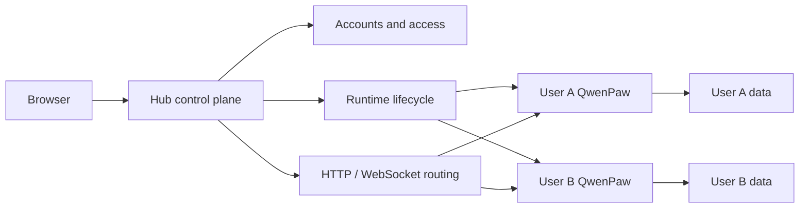

# QwenPaw Hub: Run QwenPaw for Your Team on Your Own Server

Starting with QwenPaw 2.2.0, non-desktop installations include QwenPaw Hub. It lets you run QwenPaw for a team on infrastructure you control.

Team members visit one address and sign in with separate accounts. Each person gets their own QwenPaw, with separate workspaces, settings, credentials, and conversations. Administrators manage users and runtimes from one place.

Nothing changes for personal use. The desktop edition remains the single-user App and does not include Hub. Hub is intended for multi-user server deployments.

Hub 2.2.0 is still an early release. It is intended for companies, labs, and internal teams whose members trust one another, not for running a public multi-tenant service for unknown users.


## A personal QwenPaw for every team member

Without Hub, offering QwenPaw to a team usually means operating separate instances by hand. Accounts, ports, data directories, and processes all need individual attention, and the work grows with the team.

Hub brings those pieces behind one entry point:

- members sign in with their own accounts;
- each member lands in their own QwenPaw Console;
- files, model settings, and integration credentials stay with that user;
- users do not need to know about internal ports, containers, or host paths.

For team members, it still feels like QwenPaw. They open a team URL instead of installing and maintaining a service themselves.

## How Hub is structured

Hub consists of a control plane and a set of personal runtimes:



The control plane does not run Agent tasks on a user's behalf. It authenticates the user, resolves the runtime that owns the request, manages that runtime's lifecycle, and forwards HTTP and WebSocket traffic to it. Model calls, tool execution, conversations, and workspace operations remain inside the user's QwenPaw.

A request follows four main steps:

1. Hub verifies the user's session.
2. It resolves the account's default runtime, creating its record on first use.
3. Hub makes sure the runtime is available and, when its start policy allows, starts it with the administrator's Local or Docker configuration.
4. Once ready, Hub proxies Console APIs and streaming connections to that runtime.

The account, authorization, and routing model is the same for Local processes and Docker containers. Administrators can change the runtime policy without changing how users reach their QwenPaw.

## One place to manage runtimes

Administrators can create accounts, see who owns each runtime, and stop, restart, or disable a runtime when needed. There is no need to infer ownership from a server process list.

Hub supports two runtime backends:

- **Local** uses the QwenPaw and Python environment installed on the host and is the shortest path to a working deployment.
- **Docker** runs one container per user and lets administrators standardize the image and limit CPU, memory, and process count.

Backend, image, and resource policy are administrative settings. Regular users do not make infrastructure choices. Docker can currently apply one CPU, memory, and process-limit policy to all containers, but Hub does not yet support different quotas per user, resource-usage accounting, multi-node scheduling, or autoscaling.


## Control data and user data stay separate

The control database stores accounts, system settings, runtime records, and administrative actions. The credential vault stores system keys and each user's model and integration credentials. Every runtime also has separate workspace, private configuration, backup, and log directories.

With Docker, these user directories remain on the host and are mounted into the corresponding container. The container is not the only copy of user data.

Stopping, restarting, rebuilding a container, or changing backends therefore preserves user data. Administrators can back up the database, credential vault, and runtime directories as one consistent set.

The operator still controls the server and its backups. Team members should only use a Hub run by themselves or an organization they trust; Hub is not a cloud service operated by the QwenPaw team.

## Built for a team-facing entry point

Hub can sit behind an existing HTTPS reverse proxy for a trusted team. It includes account management, a self-registration switch, separate login and registration limits, IP blocking, and an administrative audit trail.

For OpenRouter, MCP, and other browser-based authorization flows, Hub creates callbacks from its public URL and routes the result to the correct user's QwenPaw.

For an internal team, disable self-registration and let administrators create accounts. HTTPS, rate limits, and IP blocking protect the sign-in entry point, but they do not strengthen isolation between user runtimes and do not turn the current release into a public service for unknown users.

## The isolation boundary

Hub separates user data, credentials, and runtime processes, but it does not give every user a dedicated virtual machine. Local currently uses Linux Bubblewrap, macOS Seatbelt, or Windows AppContainer plus a Job Object. Docker creates a separate container for each user.

Local runtimes share the host kernel. Docker runtimes share the Linux kernel used by the Docker Engine. These mechanisms fit self-hosted collaboration within a trusted team, but they are not a strong multi-tenant boundary for unknown users. Mutually untrusted users, high-risk code, or stricter compliance requirements call for virtual machines, microVMs, dedicated nodes, or another stronger infrastructure boundary.

## An early foundation

Version 2.2.0 starts with account management, personal runtimes, request routing, and basic container limits so trusted teams can begin using Hub. Per-user quotas, resource-usage accounting, Kubernetes support, multi-node scheduling, autoscaling, and stronger tenant isolation remain future directions.

Stay tuned, or read the [contribution guide](/docs/contributing) and help design and build these capabilities directly.

## Get started

QwenPaw Hub is available in non-desktop installations starting with version 2.2.0. Install or upgrade the Python package with the Hub dependencies:

```bash
pip install -U "qwenpaw[hub]"
```

Start it on the loopback interface:

```bash
qwenpaw hub --host 127.0.0.1 --port 8000
```

The first registered account becomes the administrator. After initialization, choose Local or Docker, create team accounts, and place Hub behind an HTTPS reverse proxy.

See the [QwenPaw Hub documentation](/docs/hub) for the complete deployment guide.
