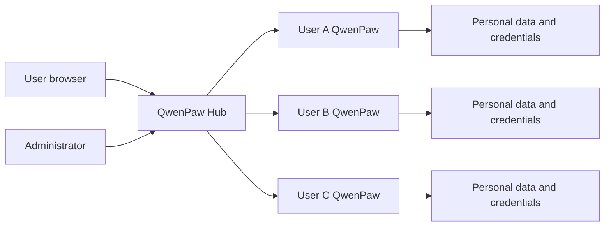

# Introducing QwenPaw Hub: A Managed QwenPaw for Every User

QwenPaw began with a personal model: one person installs one QwenPaw and owns its models, memory, Skills, and workspace. When a team wants to offer QwenPaw on its own server, different questions appear. Who can sign in? Where do user files and secrets live? Can one runtime affect another? Can a user undo an administrator's stop merely by refreshing the page? Who selects Docker images and resource limits?

QwenPaw Hub answers those questions with a unified entry point and one independently managed QwenPaw runtime per account. It does not change the single-user product: personal users continue to run `qwenpaw app`.

The boundary must be explicit. Hub does not provide one kernel per tenant. Linux Local uses Bubblewrap namespaces, macOS Local uses Seatbelt, and Windows Local uses AppContainer plus a Job Object; each shares its host kernel. Docker containers share the Linux kernel used by their Engine. “Independent runtime” means separate data, credentials, process or container, and lifecycle—not a separate VM or microVM.

## One entry point, personal runtimes

Hub owns accounts, authorization, runtime lifecycle, and request routing. Each user still sees the familiar QwenPaw Console, while conversations, files, model settings, and integration credentials stay with that user's runtime.

Users never need to enter internal ports or access a host `127.0.0.1` endpoint directly. They can work in QwenPaw, manage personal credentials, change their password, and restart a failed or normally stopped runtime. Backend, image, and capacity policy remain administrative decisions.

## An admin center that identifies real owners

Administrators can filter runtimes by username, immutable user ID, state, and backend. The list uses server-side pagination and batched owner lookup, so showing usernames does not introduce an N+1 query as data grows. If an account is later removed, historical runtimes still display its stable user ID.

Account controls prevent common lockouts: regular users cannot rename themselves or change roles; administrators cannot accidentally demote or disable themselves; and the system always retains at least one active administrator.

## Stop and disable-start are different decisions

A normal stop physically releases the process or container and lets the user restart it later. Disable-start also stops the runtime but reserves its next start for an administrator. Observed state, desired state, and start permission are stored separately, so user navigation and automatic recovery cannot overwrite an explicit administrative decision.

Failed runtimes expose a self-service restart action. Runtimes disabled by an administrator do not.

## Local and Docker, selected once by the administrator

Local reuses the host QwenPaw and Python installation without silently falling back to an ordinary process. Linux uses Bubblewrap, macOS uses Seatbelt, and Windows uses AppContainer with a kill-on-close Job Object.

Windows Local supports Windows 10 1507 or newer and requires Hub to run as Administrator. Hub enables a Windows loopback exemption for the runtime's AppContainer SID while it is active. The AppContainer opens an outbound reverse TCP tunnel, the control plane proxies QwenPaw through it, and Hub removes the rule and closes the tunnel on stop. This also lets Windows Local reach host loopback services, so it is not a separate network boundary. Missing privileges, filesystem ACL enforcement, process-tree control, rule configuration, tunnel connectivity, or the real runtime health check makes startup fail closed.

These are process and filesystem controls, not separate kernels. Higher-risk deployments still need virtual machines, microVMs, dedicated nodes, or another infrastructure boundary.

Docker creates one container per account, publishes its port only on host loopback, prevents new privileges, and leaves restart policy under Hub control. Administrators can select the official Docker Hub or Alibaba Cloud repository, a remote custom image, or an existing local tag. Hub displays the effective repository, tag, local state, and digest/ID, and pins the actual image used by a runtime until an explicit rebuild.

CPU, memory, PID, shared-memory, and global concurrent-runtime limits protect host capacity without exposing infrastructure choices to regular users.

## Containers can change without taking user data with them

User data remains in stable directories under the Hub root. Docker mounts the workspace, private configuration, and backups into standard container paths. Stopping, restarting, rebuilding, or switching between Local and Docker preserves those directories. Retiring a runtime registration also leaves the data on disk to avoid turning one mistaken click into irreversible loss.

Retention is not backup. A real deployment must back up the control database, credential-vault key, and every runtime directory as one consistent set.

## Basic defenses for a public entry point

Hub refuses a non-loopback listener before an administrator exists and requires an explicit public-listening flag. It provides separate login and registration rate limits, IPv4/IPv6/CIDR blacklists, strict trusted-proxy handling, and self-hosted Terms that users must accept.

The browser-facing `public_base_url` also drives OpenRouter, MCP, and other OAuth callbacks. Hub routes a callback to the correct user runtime, but it does not invent metadata that an OAuth server has not published. MCP services without Protected Resource Metadata still require administrator-provided authorization and token endpoints.

## Auditing and operational state

The admin center shows account and runtime counts, state distribution, Local and Docker availability, and important sanitized administrative actions. Operators can locate failed runtimes, confirm backend health, and trace account, configuration, and lifecycle changes.

Production deployments should connect Hub to their existing monitoring for HTTP latency and errors, host resources, Docker state, service logs, WebSocket disconnects, backups, and alerting.

## An honest security boundary

QwenPaw Hub is self-hosted software, not a SaaS operated by the QwenPaw team. The instance operator controls the server, database, backups, and processes and may be able to access user data. Users should sign in only to an instance run by themselves or a trusted organization.

Local on Linux, macOS, and Windows shares the host kernel. Docker shares the Linux kernel used by its Engine. These boundaries reduce cross-account interference but do not give every user a separate kernel. Mutually untrusted users and higher-risk workloads require stronger infrastructure isolation plus HTTPS, host hardening, network controls, backup, and monitoring.

The goal is a boundary administrators and users can understand: operators know what they manage, users know who receives their data, and the system fails explicitly when isolation is unavailable instead of hiding risk behind the word “sandbox.”

## Start deploying

Read the [QwenPaw Hub documentation](/docs/hub) to initialize an administrator and configure runtime, Docker, access security, OAuth, backups, and operations. Personal users do not need to migrate—`qwenpaw app` remains the original single-user QwenPaw.
