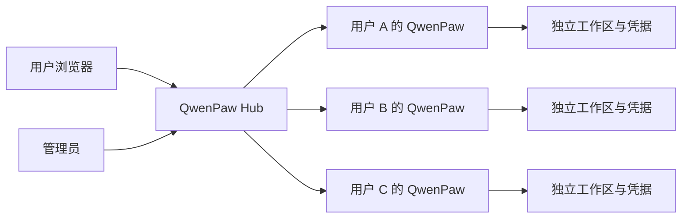

# Introducing QwenPaw Hub：为团队部署多租户 QwenPaw

QwenPaw 最初围绕个人设备设计：一个人安装一个 QwenPaw，配置自己的模型、记忆、Skills 和工作区。这种方式足够直接，也让数据和能力始终围绕个人展开。

但当一个团队希望在自己的服务器上提供 QwenPaw 时，问题就变了：谁可以登录？不同用户的文件和密钥放在哪里？一个人的进程异常会不会影响其他人？管理员停止实例后，用户访问页面会不会又把它自动拉起？Docker 镜像和资源上限又应该由谁决定？

QwenPaw Hub 就是对这些问题的回答。它是面向团队自托管场景的多租户 QwenPaw 平台：在统一入口后，为每个账户运行一个独立、可管理的 QwenPaw，而不是把同一个 QwenPaw 页面简单分享给所有人。

先说明它的安全边界：当前 Hub 不为每个用户提供独立内核。Linux Local 使用 Bubblewrap namespace，macOS Local 使用 Seatbelt，Windows Local 使用 AppContainer 和 Job Object；三者都共享各自的宿主机内核。Docker 使用容器隔离，所有 Hub 容器共享 Docker Engine 所使用的 Linux 内核。在 Windows 或 macOS 的 Docker Desktop 环境中，这通常是 Docker Linux VM 的内核，但仍不是一租户一内核。这里的“独立运行环境”指独立的数据目录、凭据、进程或容器和生命周期管理，不代表每个用户拥有独立虚拟机或 MicroVM。

## 从一个应用到一组个人运行环境

Hub 的核心模型很简单：

Hub 负责账户、授权、运行环境生命周期和请求路由；每个用户看到的仍然是熟悉的 QwenPaw Console。对话、文件、模型配置和集成凭据属于个人运行环境，不会因为共用一个登录入口而混在一起。

这套模式也保留了原有单机产品。个人用户继续运行 `qwenpaw app` 即可，Hub 是一个明确、独立的多用户启动方式，不会改变本地 App 的启动和使用链路。

## 用户不需要理解基础设施

普通用户登录后，Hub 会找到或创建属于他的个人运行环境，并把浏览器流量代理过去。用户不需要填写内部端口，也不会直接接触宿主机上的 `127.0.0.1` 地址。

他可以像使用个人 QwenPaw 一样：

- 进行对话并管理自己的工作区；
- 配置个人模型与集成凭据；
- 修改密码；
- 在运行环境失败或普通停止后自行重启；
- 在运行环境能力受限时看到明确提示。

运行环境后端、Docker 镜像和资源限制不交给普通用户选择。它们是整个平台的基础设施策略，由管理员统一决定。这样既减少了用户需要理解的概念，也避免了任意镜像和任意资源参数进入宿主机。

## 管理员终于能看见“谁在运行什么”

Hub 管理中心围绕日常运维重新组织，而不是把底层数据库直接暴露成表格。

管理员可以按用户名、用户 ID、状态和后端查询运行环境，查看每个实例的实际所有者、更新时间和错误。用户量增加后，列表仍然通过服务端分页和批量关联账户，不会为每一行单独查询用户名。

账户管理也遵守几个重要约束：

- 用户名用于识别和搜索，稳定用户 ID 用于所有权；
- 普通用户不能自行改名或改变角色；
- 管理员不能误操作把自己的管理员权限取消；
- 系统始终要求保留至少一个有效管理员。

这些看起来是后台管理里的小细节，却决定了一个长期运行的自托管服务是否容易被安全地维护。

## 停止和禁止启动不是一回事

管理员有时只是想释放资源，有时则必须阻止一个账户继续运行。Hub 因此区分两种操作：

- **停止**：物理停止进程或容器，用户之后可以自行重启；
- **禁止启动**：停止运行环境，并将启动权限收回到管理员，用户刷新或继续访问都不会自动恢复。

运行环境同时记录实际状态、期望状态和启动策略。这样，页面访问、用户重启和管理员操作不会围绕同一个布尔值互相覆盖。

当运行环境自身报错时，用户页面会提供重启能力，不需要为了一个可恢复故障等待管理员；当管理员明确禁止启动时，这个自助入口则不会绕过管理策略。

## Local 和 Docker，由管理员统一选择

不同部署环境对隔离和运维成本有不同要求。Hub 提供 Local 和 Docker 两种后端，并支持 Linux、macOS 和 Windows。Windows 也可以在 Docker Engine 运行 Linux 容器时选择 Docker 后端。

### Local：进程级隔离

Local 后端复用宿主机的 QwenPaw 与 Python 环境，但不会在隔离能力缺失时直接启动普通进程：Linux 使用 Bubblewrap，macOS 使用 Seatbelt，Windows 使用 AppContainer 和 Job Object，并在启动前验证运行环境只能看到允许的路径。

Windows Local 要求 Windows 10 1507 或更高版本，并要求 Hub 以管理员权限运行。Hub 在运行环境存续期间为其 AppContainer SID 启用 Windows loopback exemption，由 AppContainer 主动建立反向 TCP 隧道，管理入口通过隧道代理其中的 QwenPaw，并在停止时撤销规则、关闭隧道。该规则同时意味着 Windows Local 可以访问宿主机 loopback，因此它不提供独立网络边界。管理员权限、文件 ACL、进程树约束、规则配置、隧道连接或真实运行环境健康检查任一失败，运行环境都会拒绝启动。

如果平台不支持所需边界，探测会失败，运行环境也会拒绝启动。这里限制的是进程和文件系统访问范围，所有 Local 运行环境仍使用宿主机内核，不能当作虚拟机或独立内核沙箱。

### Docker：容器级隔离

Docker 后端为每个账户创建独立容器，只把内部服务端口发布到宿主机回环地址。Hub 负责容器创建、停止、健康检查和清理，用户无需接触 Docker。

Docker 提供进程、文件系统和资源层面的容器边界，但同一个 Engine 中的容器共享该 Engine 使用的 Linux 内核。在原生 Linux 上通常是宿主机内核；在 Windows/macOS Docker Desktop 环境中通常是 Docker Linux VM 的内核。两种情况都不等同于一租户一虚拟机、MicroVM 或独立内核。

管理员可以统一选择：

- Docker Hub 官方镜像；
- 阿里云官方镜像；
- 远程自定义镜像；
- 宿主机已经存在的本地镜像 Tag。

镜像策略会显示最终使用的完整镜像、Tag、本地状态以及实际 digest/ID。创建运行环境后，Hub 固定实际镜像版本，避免同一个可变 Tag 在普通重启时悄悄改变。管理员明确执行重建时，才会重新采用当前镜像策略。

每个容器还可以统一设置 CPU、内存、PID 和共享内存上限。整个 Hub 则可以设置同时运行的环境数量，避免新用户或异常访问无限消耗宿主机资源。

## 容器会变，用户数据不会跟着消失

无论使用 Local 还是 Docker，用户数据都保存在 Hub 宿主机上的稳定目录中。Docker 只是把这些目录挂载到容器里的标准位置：

| 数据     | 宿主机                | 容器内                 |
| -------- | --------------------- | ---------------------- |
| 工作区   | 运行环境的 `working/` | `/app/working`         |
| 私密配置 | 运行环境的 `secret/`  | `/app/working.secret`  |
| 备份     | 运行环境的 `backups/` | `/app/working.backups` |

所以停止、重启、容器重建以及 Local/Docker 切换都不需要复制用户工作区。即使管理员删除运行环境注册，Hub 也会保留磁盘数据，避免一次误操作直接变成数据事故。

当然，保留不等于备份。真正的部署仍需同时备份控制数据库、凭据库密钥和全部运行环境目录。

## 面向公开入口的基本防线

一个多用户入口不可避免地会面对注册滥用、暴力登录和错误代理配置。Hub 提供了几项基础控制：

- 默认拒绝监听非回环地址；
- 公开监听前要求已经初始化有效管理员；
- 公开监听要求配置浏览器实际访问的 `public_base_url`；
- 登录和注册分别限流；
- 支持 IPv4、IPv6 和 CIDR 黑名单；
- 只有可信代理提供的 `X-Forwarded-For` 才会被采用；
- 用户必须阅读并同意自托管用户条款。

`public_base_url` 不只是一个界面字段。OpenRouter、MCP 等 OAuth 流程需要通过它生成浏览器可以返回的 Hub 回调地址。过去在单机环境中合理的 `127.0.0.1`，到了远程自托管环境就不再成立。

Hub 会把回调路由到正确的用户运行环境，但不会猜测第三方没有发布的 OAuth 元数据。某些 MCP 服务缺少自动发现信息时，仍需按照服务方说明手工填写授权端点和 Token 端点。

## 审计与运行状态

管理中心集中展示用户和运行环境数量、运行状态分布、Local 与 Docker 后端可用性，并记录关键管理操作。管理员可以快速定位失败的运行环境，确认后端是否可用，并追溯账户、配置和运行环境的管理变更。

对于生产部署，Hub 可以与现有监控体系配合使用。部署者可继续采集 HTTP 延迟与错误率、主机资源、Docker 容器状态和服务日志，并根据自身运维要求配置告警。

## 安全边界必须说清楚

QwenPaw Hub 是自托管软件，不是由 QwenPaw 团队代为运营的 SaaS。实例运营者控制服务器、数据库、备份和进程，也可能接触用户在该实例中保存的数据。因此，用户只应登录本人或可信组织部署的 Hub。

每个 QwenPaw 都运行在受约束的环境中，文件、进程、设备和网络能力可能不如个人电脑上的完整版本。Linux、macOS 和 Windows 的 Local 进程沙箱共享各自的宿主机内核，Docker 容器共享 Docker Engine 使用的 Linux 内核。它们能够降低账户之间相互影响的风险，但不为每个用户提供独立内核。

对于彼此不信任的用户或更高风险的多租户场景，部署者应在 Hub 外增加一租户一虚拟机、MicroVM、专用节点或其他更强的基础设施隔离，并继续配置 HTTPS、主机加固、网络边界、备份和监控。

我们希望 Hub 提供的是一个诚实、可理解的边界：管理员知道自己正在管理什么，用户知道数据交给了谁，系统在隔离能力缺失时明确失败，而不是用“沙箱”两个字掩盖所有风险。

## 开始部署

如果你准备在自己的服务器上运行 QwenPaw Hub，可以阅读 [QwenPaw Hub 文档](/docs/hub)，完成管理员初始化，并继续配置运行环境、Docker、安全、OAuth、备份和监控。

个人用户无需迁移：`qwenpaw app` 仍然是原来的单机 QwenPaw。只有当你确实需要为多个人提供统一、自托管的入口时，QwenPaw Hub 才会出现。
