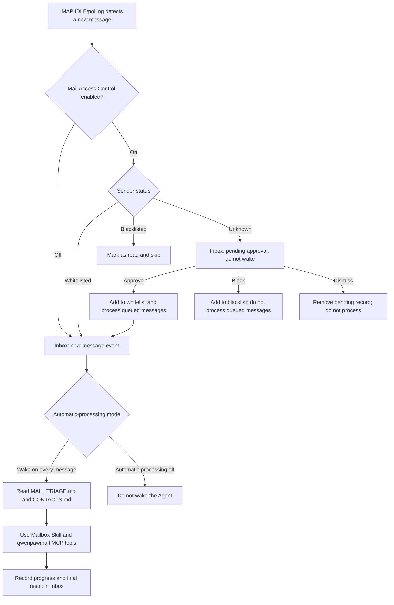

Does a constantly growing backlog make your inbox feel overwhelming? Do new messages demand your attention just when you need to focus elsewhere?

Imagine a typical day: a customer sends a new question, a delivery update is buried among promotions, a meeting invitation needs a response, contract attachments need filing, and several messages you already read are still waiting for a reply. The time we spend on email is rarely just about writing replies. It is also spent searching, filtering, organizing, and deciding what to do next.

Now you can connect a separate mailbox to each Agent in QwenPaw. The Agent can search, summarize, reply to, and organize email when you ask in chat. It can also start working as soon as a new message arrives, handle it in the background according to your preferences, and deliver the result to the QwenPaw Inbox.

That does not mean the Agent can do whatever it wants with your mailbox. You can review unknown senders, approve the Agent's email actions, and keep decisions involving security or privacy in your own hands.


## QwenPaw Mail

QwenPaw Mail uses IMAP/SMTP to receive, search, send, reply to, and forward messages, as well as handle attachments, organize mail, group conversations, and analyze mailbox statistics. When automatic new-message handling is enabled, the Agent uses a predefined mail triage tree to process incoming email. For situations outside those predefined scenarios, it can explore a solution while asking for your input, then turn its execution trace and your preferences into new rules in the triage tree. Over time, mailbox management can evolve around the way you work.

Two components work together to provide mailbox management:

- The built-in **qwenpawmail MCP** provides 22 tools for reliably reading from and writing to a real mailbox.
- The **Mailbox Skill** defines account connection, tool selection, contact maintenance, automatic triage, and safety boundaries.

## What Can It Take Off Your Plate?

You do not need complicated email commands. Describe the goal just as you would to an assistant.

| When this happens                                 | Ask QwenPaw                                                                                                    |
| ------------------------------------------------- | -------------------------------------------------------------------------------------------------------------- |
| You return from time off to a wall of unread mail | “Summarize the important messages from the past week and rank the action items by urgency.”                    |
| You need to recover an earlier conversation       | “Find messages from the past 30 days with ‘contract’ in the subject and tell me what is still unresolved.”     |
| Attachments are scattered across messages         | “Save the attachments from this message to the contract review folder.”                                        |
| A long email thread needs a careful response      | “Summarize the context of this thread and draft a reply. Show it to me before sending.”                        |
| Your inbox needs routine cleanup                  | “Mark all marketing messages as read and archive them. Move spam to the junk folder.”                          |
| You want to understand your communication rhythm  | “Show my sent and received volume, messages awaiting a reply, and average response time for the past 14 days.” |

## Supported Email Providers

QwenPaw's managed mailbox flow currently supports the following nine email domains:

| Email domain  | Provider             | Required credential             | IMAP / SMTP                                   |
| ------------- | -------------------- | ------------------------------- | --------------------------------------------- |
| `163.com`     | NetEase 163          | 16-character authorization code | `imap.163.com:993` / `smtp.163.com:465`       |
| `126.com`     | NetEase 126          | 16-character authorization code | `imap.126.com:993` / `smtp.126.com:465`       |
| `yeah.net`    | NetEase yeah.net     | 16-character authorization code | `imap.yeah.net:993` / `smtp.yeah.net:465`     |
| `qq.com`      | QQ Mail              | 16-character authorization code | `imap.qq.com:993` / `smtp.qq.com:465`         |
| `foxmail.com` | QQ Mail alias domain | 16-character authorization code | `imap.qq.com:993` / `smtp.qq.com:465`         |
| `sina.com`    | Sina Mail            | 16-character authorization code | `imap.sina.com:993` / `smtp.sina.com:465`     |
| `sina.cn`     | Sina Mail            | 16-character authorization code | `imap.sina.cn:993` / `smtp.sina.cn:465`       |
| `aliyun.com`  | Aliyun Mail          | Mailbox login password          | `imap.aliyun.com:993` / `smtp.aliyun.com:465` |
| `gmail.com`   | Gmail                | 16-character app password       | `imap.gmail.com:993` / `smtp.gmail.com:465`   |

## Enable Mailbox Management

### Manage Your Personal Mailbox

Follow the [reference document](https://qwenpaw.agentscope.io/docs/mailbox/#%E4%BD%BF%E7%94%A8%E5%89%8D%E5%87%86%E5%A4%87) to complete the preparation work before starting. First, enable **IMAP/SMTP** in your provider's web settings and prepare a client authorization code or app password.

Keep in mind that a **16-character authorization code is not your mailbox password**. To obtain a Gmail app password, first enable 2-Step Verification from your Google Account, then create an app password for Gmail.

Once the credential is ready, complete these steps in QwenPaw:

1. Open **Settings → Agent Management**, then create or edit a QwenPaw Agent.
2. Under **Email Management**, select **Manage your personal mailbox**.
3. Enter the mailbox name, domain, and corresponding authorization code or password.
4. Choose how new messages should be handled:
   - **Off**: manage the mailbox only when requested in chat; do not monitor new messages.
   - **Wake for every message**: automatically wake the Agent whenever a new message arrives.
5. If you select **Wake for every message**, you can also enable **Mail Access Control** so unknown senders wait for your decision.
6. Save the Agent.


### Register a Dedicated Mailbox for an Agent

**Provision a dedicated mailbox** is a guided flow. Saving the Agent configuration records the registration intent; it does not immediately create an account with the provider. Registration still takes place on the provider's website.

- Under **Settings → Agent Management**, select **Provision a dedicated mailbox**.
- Select an email domain and optionally enter your preferred mailbox name. If left blank, the Agent uses `create_mailbox` to generate a random name that follows the provider's rules.
- You can leave the credential blank at this stage. After saving, open a chat with the Agent and ask it to “register and connect a dedicated mailbox for yourself.”
- The Agent first opens the provider's registration page in the browser. You complete sensitive or interactive steps—including passwords, phone numbers, image or SMS verification codes, sliders, and agreement confirmation—directly on that page. QwenPaw does not store this registration information in its configuration.
- After registration, enable IMAP/SMTP in the provider's settings, generate an authorization code, and verify both receiving and sending.
- Reopen the Agent configuration, keep **Provision a dedicated mailbox for the Agent** selected, enter the final mailbox name and credential, and save. QwenPaw automatically sets `is_new_account` to `false`, encrypts the secret, synchronizes the managed DriverCard, and reloads the Agent.

Final name availability is determined by the provider's registration page in real time.


### Verify Receiving and Sending

After saving, check in the MCP client that `qwenpawmail` is enabled and active. Then send the following message in a chat with the Agent:

```text
Check whether my mailbox authentication is working, then list my mail folders.
```

QwenPaw checks the receiving and sending connections separately.


## Manage Email in Chat

After setup, you can manage the mailbox directly with natural-language requests. For example:

```text
List the 10 newest messages in my inbox. Show only the sender, subject, and time.
Search the past 30 days for messages with “contract” in the subject and summarize the action items.
Save all attachments from this message to attachments/contract-review/.
Reply that I am available Wednesday afternoon. Show me the draft before sending.
Mark these three messages as read and move them to Archive.
List customer threads awaiting a reply and calculate the average response time for the past 14 days.
```

qwenpawmail MCP uses the `ask` policy by default, so tool calls are sent for user approval. For automatic handling, you can set the necessary low-risk tools or specific call sources to `allow`.


## Automatically Process New Email

After you select **Wake for every message**, QwenPaw monitors the mailbox Inbox in real time and automatically processes newly received messages. When supported by the provider, it prefers IMAP IDLE. If the provider does not support IDLE, or IDLE fails three consecutive times, it automatically falls back to polling. The default polling interval is 120 seconds, with a minimum of 10 seconds.

IDLE connections are rebuilt periodically—every 25 minutes for most providers. Because QQ and Foxmail IDLE notifications can be unreliable, QwenPaw actively checks for new messages at least every two minutes even when the server sends no `EXISTS` notification. Network errors use exponential backoff, retrying after no more than 60 seconds.

The workflow is as follows:

1. If Mail Access Control is enabled, first check the authenticated sender identity against the whitelist, blacklist, and pending state.
2. Write a new-message event and body preview to the Console **Inbox**.
3. Decide whether to wake the Agent based on the automatic-processing mode.
4. The Agent reads `MAIL_TRIAGE.md` and `CONTACTS.md` before classifying, organizing, extracting information from, or responding to the message.
5. Write the final summary and tool trace back to the Inbox as an `auto_handled` event. Timeouts and failures also leave an error event.



On its first start, the monitor records only the latest current UID as its baseline and does not process historical messages. If the Inbox is empty at startup, the first message received afterward is processed normally. Switching mailboxes or detecting a `UIDVALIDITY` change also creates a new baseline, preventing messages from an old mailbox or UID space from being mistaken for new mail.

For each message, the automatic workflow fetches at most the first 64 KiB and uses roughly 2,000 characters as the body preview. Attachments are not downloaded as message text. Plain text is preferred; when only HTML is available, QwenPaw extracts readable text.


### Agent Mail-Handling Rules and Workflow

1. After the Agent wakes, it consults `MAIL_TRIAGE.md` and `CONTACTS.md` before deciding how to manage the message:
   - `MAIL_TRIAGE.md` is the Agent's mail triage guide, available to view and edit under **Workspace → Files**. Its default rules cover:
     - Category A: mailbox-state operations such as marking as read, archiving, starring, and isolating spam.
     - Category B: information extraction such as updating records, saving attachments, and capturing contacts.
     - Category C: time-sensitive work such as reminders, calendars, travel, and logistics tracking.
     - Category D: replies, continued thread conversations, forwarding, and new messages to known contacts.
     - Category E: one-time results such as extracting verification codes.
     - Category F: F1 exploration when a message cannot be classified, confidence is low, an action is irreversible, or an email link must be opened.
   - `CONTACTS.md` stores known contacts and relationship context. Automatic sending is limited to known contacts or the sender of the original message. For money, commitments, or sensitive relationships, the Agent should only draft a response and ask for confirmation.
2. The Agent matches each new message against the triage tree's “Matching Criteria” from top to bottom. On a match, it executes the “Prerequisite Toolchain → Final Action”; compound scenarios follow combination rules.
3. If nothing matches or confidence is low, the Agent follows Category F and enters **F1 Exploration Mode**:
   1. It analyzes the message's intent from the recipient's perspective and plans a handling workflow.
   2. **Every subsequent tool call** is elevated to strict approval, including mail, file, browser, and shell tools.
   3. Before each call, the Agent explains why it is needed, and the system presents the reason and operation to the user:
      - Approve → the tool runs normally.
      - Deny → the tool is blocked and returns the denial to the Agent, which tries a different approach.
   4. After three consecutive denials, or when no viable path remains, the Agent explains the situation in its final response and asks the user what to do.
4. When F1 exploration ends, whether or not it succeeded, the Agent reviews the entire workflow:
   1. It distills a reusable approach for this class of message and completes all four fields: Matching Criteria, Prerequisite Toolchain, Final Action, and Source. The source uses the format “F1 Exploration + date.”
   2. Before editing, it creates `MAIL_TRIAGE.md.bak`. It then appends the new leaf under the appropriate top-level category in `MAIL_TRIAGE.md`. Top-level categories may be added but not modified; deprecated leaves move to the `deprecated` section rather than being deleted.
   3. It validates the format after editing so the Agent can keep learning new scenarios and user preferences.
5. If the Agent replies to a message, it updates the contact list in `CONTACTS.md` based on the exchange.


## Mail Access Control

Mail Access Control is available only while automatic processing is enabled. It lets you review messages from unknown senders and whitelist or blacklist those senders. Open **Mail Access Control** from the Console Inbox to manage pending senders, the whitelist, and the blacklist for each mailbox Agent.

Pending senders, the whitelist, and the blacklist can all be filtered by Agent and managed individually or in batches. List entries can also include a display name and notes.

### Review Unknown Senders

When access control is enabled and a message arrives from a sender who is not on either list, the message enters the pending-sender list. You can see the receiving Agent, sender address, sender name, subject, body preview, and received time; add notes if needed; and decide whether to **Approve, Block, or Dismiss** the sender:

- **Approve**: add the sender to the whitelist and process every message saved in that pending record. Failed processing remains in the retry queue and can continue after a restart.
- **Block**: add the sender to the blacklist and remove the pending record. Messages already received remain unchanged; future messages are marked as read and skipped.
- **Dismiss**: remove only the current pending record without adding the sender to either list. The sender's next message enters pending approval again; previously dismissed messages are not processed automatically.

> The first message from an unknown sender enters the pending list. The Agent does not read or process it and is not awakened.
> While the sender remains pending, later messages are silently skipped and remain unread, without creating duplicate notifications.
> Each Agent retains at most 500 pending-sender records; once the limit is exceeded, the oldest record is removed.

### Sender Lists

Sender lists can be edited by reviewing pending senders or adding entries manually.

- **Whitelist**: future messages from the address pass through immediately and follow the configured automatic-response mode.
- **Blacklist**: future messages from the address are marked as read and skipped.

> Sender entries support exact addresses and `*@example.com` domain wildcards; `*@*` is not supported.
> Select a specific Agent when adding a sender. If no Agent is selected, the entry is broadcast to every Agent with mailbox management enabled.


## Further Reading

- [QwenPaw Mail documentation](https://qwenpaw.agentscope.io/docs/mailbox)
- [QwenPaw GitHub repository](https://github.com/agentscope-ai/QwenPaw)
