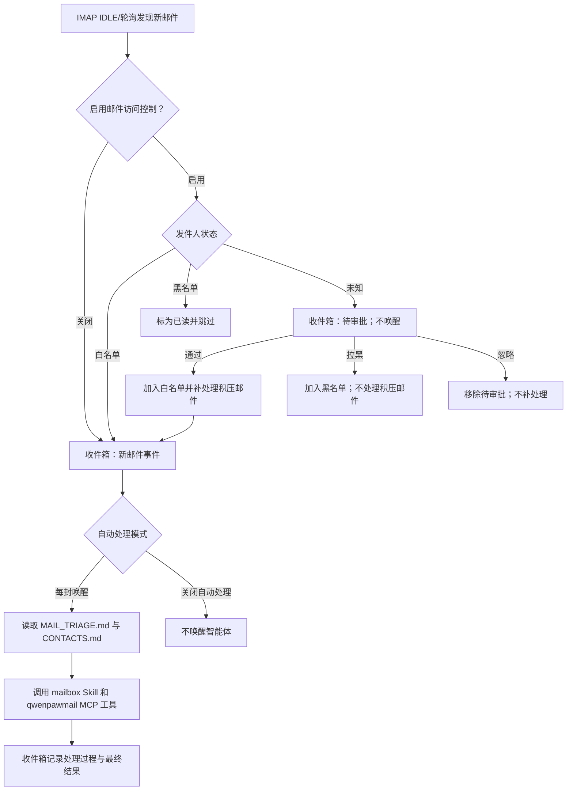

你是不是每天都苦于处理邮箱中积压的大量邮件，并且为需要随时处理新邮件而感到分身乏术？

试想以下场景：客户发来新问题，快递通知夹在促销邮件中，会议邀请需要确认，合同附件等着归档，还有几封邮件明明看过，却忘了继续回复。我们每天花在邮箱里的时间，往往不只是回复一封邮件，而是不断搜索、筛选、整理和确认下一步。

现在，你可以在 QwenPaw 中为每个 Agent 连接一个独立邮箱。它既能在聊天中按你的要求查信、总结、回复和整理，也能在新邮件到达时主动开始工作，根据你的邮件处理习惯在后台自动帮你处理，并把处理结果送到 QwenPaw 收件箱。

你也不必担心智能体会任意处置邮箱。未知发件人和关键操作都可以交由你审批，涉及安全或隐私的决定始终由你掌控。


## QwenPaw Mail

QwenPaw Mail 功能主要通过 IMAP/SMTP 完成收信、搜索、发信、回复、转发、附件处理、邮件整理、会话聚合和统计分析。启用新邮件自动响应后，智能体会利用预设的邮件分诊树对邮箱中的新邮件进行自动化处理，对于预设场景外的情况，智能体会尝试自主探索并征求用户的意见，并将处理轨迹与用户偏好整理成新的处理规则，更新到邮件分诊树中，实现面向用户的邮件管理自主进化。

邮箱管理能力由两部分协同完成：

- 内置的 **qwenpawmail MCP** 提供 22 个工具，负责可靠地读写真实邮箱；
- **Mailbox Skill** 规定账户连接、工具选择、联系人维护、自动分诊和安全边界。

## 它能替你做哪些事？

你不需要用复杂的邮箱处理命令，直接像给助理交代工作一样描述目标即可。

| 你遇到的情况               | 可以这样告诉 QwenPaw                                             |
| -------------------------- | ---------------------------------------------------------------- |
| 休假回来，未读邮件堆成一片 | “总结最近一周的重要邮件，按紧急程度列出待办。”                   |
| 想找回某次沟通             | “找到最近 30 天主题包含‘合同’的邮件，告诉我还有哪些问题没确认。” |
| 附件散落在不同邮件里       | “把这封邮件的附件保存到合同审阅文件夹。”                         |
| 需要继续一段长邮件往来     | “整理这个会话的前因后果，帮我写一封回复，发送前让我确认。”       |
| 收件箱需要日常整理         | “把所有的营销邮件标为已读并归档，垃圾邮件移到垃圾箱。”           |
| 想了解自己的沟通节奏       | “统计最近 14 天的收发量、待回复邮件和平均回复时间。”             |

## 支持的邮箱服务商

QwenPaw 当前的托管邮箱流程支持以下 9 个邮箱域名：

| 邮箱域名      | 服务商        | 所需凭据          | IMAP / SMTP                                   |
| ------------- | ------------- | ----------------- | --------------------------------------------- |
| `163.com`     | 网易 163      | 16 位授权码       | `imap.163.com:993` / `smtp.163.com:465`       |
| `126.com`     | 网易 126      | 16 位授权码       | `imap.126.com:993` / `smtp.126.com:465`       |
| `yeah.net`    | 网易 yeah.net | 16 位授权码       | `imap.yeah.net:993` / `smtp.yeah.net:465`     |
| `qq.com`      | QQ 邮箱       | 16 位授权码       | `imap.qq.com:993` / `smtp.qq.com:465`         |
| `foxmail.com` | QQ 邮箱别名域 | 16 位授权码       | `imap.qq.com:993` / `smtp.qq.com:465`         |
| `sina.com`    | 新浪邮箱      | 16 位授权码       | `imap.sina.com:993` / `smtp.sina.com:465`     |
| `sina.cn`     | 新浪邮箱      | 16 位授权码       | `imap.sina.cn:993` / `smtp.sina.cn:465`       |
| `aliyun.com`  | 阿里邮箱      | 邮箱登录密码      | `imap.aliyun.com:993` / `smtp.aliyun.com:465` |
| `gmail.com`   | Gmail         | 16 位应用专用密码 | `imap.gmail.com:993` / `smtp.gmail.com:465`   |

## 启用邮箱管理

### 管理你的个人邮箱

参考[说明文档](https://qwenpaw.agentscope.io/docs/mailbox/#%E4%BD%BF%E7%94%A8%E5%89%8D%E5%87%86%E5%A4%87)完成开始前准备，先在邮箱服务商的网页版设置中启用 **IMAP/SMTP**，并准备客户端授权码或应用专用密码。

需要注意的是，**16 位授权码不是你的邮箱密码**。获取 Gmail 应用专用密码则需要先在 Google 个人主页中开启两步验证，再为 Gmail 创建应用专用密码。

准备好后，在 QwenPaw 中完成下面几步：

1. 打开 **设置 → 智能体管理**，新建或编辑一个 QwenPaw Agent；
2. 在 **邮箱管理** 中选择 **管理你的个人邮箱**；
3. 填写邮箱名称、域名和对应的授权码或密码；
4. 选择新邮件处理方式：
   - **关闭**：只在聊天中按需管理邮箱，不监控新邮件；
   - **每封唤醒**：收到新邮件后自动唤醒 Agent；
5. 如果选择每封唤醒，可以继续打开 **邮件访问控制**，让陌生发件人先等待你的决定；
6. 保存 Agent。


### 为智能体注册专用邮箱

**为智能体配备专属邮箱** 是引导式流程。保存智能体配置只会记录注册意图，不会立即创建
服务商账户，注册仍需在服务商网页完成。

- 在 **设置 → 智能体管理** 中选择 **为智能体配备专属邮箱**。
- 选择邮箱域名，可按需填写期望的邮箱名。留空时，智能体会用 `create_mailbox` 生成符合规则的
  随机名称。
- 此时凭据可以留空。保存后打开该智能体的聊天，请它“为自己注册并连接专用邮箱”。
- 智能体会优先在浏览器中打开服务商注册页面。遇到密码、手机号、图片/短信验证码、滑块和
  协议确认时，由你直接在网页中完成必要的人工步骤。这些注册信息不会保存到 QwenPaw 配置中。
- 注册完成后，在服务商设置中启用 IMAP/SMTP 并生成授权码，再验证收发信连接。
- 重新打开智能体配置，保持选择 **为智能体配备专属邮箱**，填写最终邮箱名和凭据后保存。
  QwenPaw 会自动把 `is_new_account` 设为 `false`、加密保存 secret、同步托管 DriverCard
  并重载智能体。

名称是否可用最终以服务商注册页面的实时结果为准。


### 验证收信和发信

保存后，在 MCP 客户端中查看 `qwenpawmail` 是否被启用且激活。随后在这个 Agent 的聊天中发送：

```text
检查我的邮箱认证是否正常，并列出邮箱文件夹。
```

QwenPaw 会分别检查收信和发信连接工具是否正常。


## 在聊天中管理邮箱

配置完成后，可以直接使用自然语言下达邮件管理任务。例如：

```text
列出收件箱最新 10 封邮件，只显示发件人、主题和时间。
搜索最近 30 天主题包含“合同”的邮件，并总结待办事项。
把这封邮件的所有附件保存到 attachments/contract-review/。
回复这封邮件，说明我周三下午有空；发送前先给我看草稿。
把这三封邮件标为已读并移动到 Archive。
按会话列出待回复的客户邮件，并统计最近 14 天的平均响应时间。
```

qwenpawmail MCP 默认采用 `ask` 策略，所以工具调用会进入用户审批。需要自动处理时，
可以为必要的低风险工具或特定调用来源配置 `allow` 策略


## 自动处理新邮件

选择 **每封唤醒** 后，QwenPaw 会实时监控邮箱的收件箱，对新收到的邮件进行自动处理。
服务商支持时优先使用 IMAP IDLE，服务商不支持 IDLE，或连续 3 次 IDLE 失败时，自动降级为轮询。
轮询默认每 120 秒一次，最短 10 秒。

IDLE 连接会定期重建：一般服务商为 25 分钟。QQ 和 Foxmail 的 IDLE 推送不稳定，因此即使
没有收到服务器的 `EXISTS` 通知，也会至少每 2 分钟主动检查一次新邮件。网络错误会指数退避，
最长 60 秒后重试。

处理流程如下：

1. 如果开启邮件访问控制，先用经过收件服务商认证的发件人身份检查白名单、黑名单和待审批状态。
2. 把新邮件事件和正文预览写入控制台 **收件箱**。
3. 根据自动处理模式决定是否唤醒智能体。
4. 智能体先读取 `MAIL_TRIAGE.md` 和 `CONTACTS.md`，再执行分类、整理、提取或沟通任务。
5. 最终摘要和工具执行轨迹以 `auto_handled` 事件写回收件箱；超时或失败也会留下错误事件。



监控器第一次启动时只记录当前最新 UID 作为基线，不处理已有历史邮件；如果启动时收件箱为空，
之后收到的第一封邮件会正常处理。切换邮箱或检测到 `UIDVALIDITY` 变化时也会重新建立基线，避免
把旧邮箱或旧 UID 空间中的邮件误当作新邮件。

自动流程对每封邮件最多抓取前 64 KiB，并截取约 2000 个字符作为正文预览。附件不会被当作正文
下载；优先使用纯文本，只有 HTML 时才提取可读文字。


### 智能体邮件处理规则和流程

1. 智能体被唤醒后，会先参考 `MAIL_TRIAGE.md` 和 `CONTACTS.md` 再生成邮件管理策略：
   - `MAIL_TRIAGE.md` 是智能体的邮件分诊手册，可以在 **工作区 → 文件** 中查看和编辑。默认策略覆盖：
     - A 类：标为已读、归档、星标、隔离垃圾邮件等邮箱状态操作；
     - B 类：台账登记、保存附件、沉淀联系人等信息提取；
     - C 类：提醒、日历、行程和物流跟踪等时间敏感任务；
     - D 类：回复、线程续谈、转发和向已知联系人发送新邮件；
     - E 类：提取验证码等一次性结果；
     - F 类：无法归类、置信度低、动作不可逆或需要点击邮件链接时进入 F1 探索。
   - `CONTACTS.md` 保存已知联系人和关系上下文。自动发信只允许发给已知联系人或原邮件发件人；涉及金钱、承诺或敏感关系时，智能体只应起草内容并请求确认。
2. 按分诊树自上而下匹配新邮件的「识别特征」，命中则按「前置工具链→终态动作」执行；复合场景按组合规则执行。
3. 全部未命中或命中置信度低时走 F 类，进入「F1 探索模式」：
   1. 代入收件人身份分析邮件意图，规划邮件处理流程；
   2. 后续 **每一次工具调用** 都会提升为严格审批，包括邮箱、文件、浏览器和 shell 等工具；
   3. 智能体会在每次调用前说明理由，系统把理由和操作展示给用户：
      - 同意 → 工具正常执行；
      - 拒绝 → 工具被阻止并返回拒绝信息，智能体会换一种思路重新尝试。
   4. 连续 3 次被拒绝或确实无可行方案，则在最终输出中说明情况并请示用户。
4. F1 探索结束后（无论成功与否），回顾整个处理过程：
   1. 总结此类邮件的通用处理做法，并补全「识别特征、前置工具链、终态动作、来源」四个字段；来源格式为「F1 探索 + 日期」；
   2. 修改前备份为 `MAIL_TRIAGE.md.bak`，再把新叶子追加到 `MAIL_TRIAGE.md` 的对应一级类下；一级类只增不改，废弃叶子移入 `deprecated` 区而不直接删除；
   3. 修改后检查格式，让智能体持续学习新场景和用户偏好。
5. 如果回复了邮件，结合本次往来更新 `CONTACTS.md` 中的联系人列表。


## 邮件访问控制

访问控制仅在自动处理已开启时可用，用于审批未知发件人的邮件以及对发件人进行加白/加黑。
打开控制台收件箱中的 **邮件管控**，即可管理每个邮箱智能体的待审批发件人、白名单和黑名单。
待处理、白名单和黑名单都支持按智能体筛选以及单条或批量操作；名单条目还可以记录显示名和备注。

### 未知发件人审批

开启访问控制后，收到不在发件人名单中的未知发件人的邮件时，该邮件会进入待审批发件人列表，列表中
可以看到收到邮件的智能体、发件人地址、发件人名称、邮件主题、正文预览、收件时间，用户可以根据需
求对其进行备注，并决定是否 **通过/拉黑/忽略** 该发件人的邮件：

- **通过**：把发件人加入白名单，并逐封补处理该记录中保存的所有邮件；处理失败会保留在重试
  队列中，重启后仍可继续；
- **拉黑**：把发件人加入黑名单并移除待审批记录。已经收到的待审批邮件仍保持原状态；此后的
  来信会被标为已读并跳过；
- **忽略**：只移除当前待审批记录，不加入任何名单。此人的下一封来信会再次进入待审批；之前
  被忽略的邮件不会自动补处理。

> 未知发件人的第一封邮件进入待审批列表，智能体不会读取处理，也不会被唤醒。
> 发件人仍在待处理时，后续来信会静默跳过并保持未读，不会重复创建提醒。
> 每个智能体最多保留 500 条待审批发件人记录，超过时移除最旧记录。

### 发件人名单

发件人名单可以通过审批发件人和手动添加发件人来编辑。

- **白名单**：后续来自该地址的邮件直接放行，并按自动响应模式处理；
- **黑名单**：后续来自该地址的邮件标为已读并跳过；

> 添加发件人时支持精确地址和 `*@example.com` 域名通配符，不支持 `*@*`。
> 添加发件人时需选择具体的智能体；若没有选择，则会把该条目广播到所有已启用邮箱的智能体。


## 延伸阅读

- [QwenPaw Mail 文档](https://qwenpaw.agentscope.io/docs/mailbox)
- [QwenPaw GitHub 仓库](https://github.com/agentscope-ai/QwenPaw)
