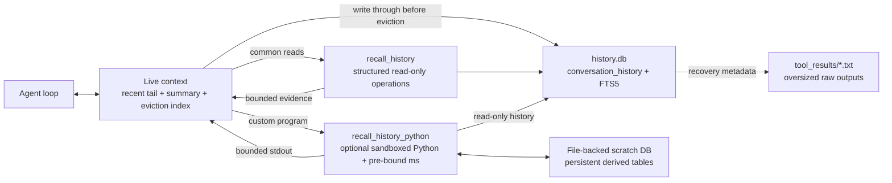
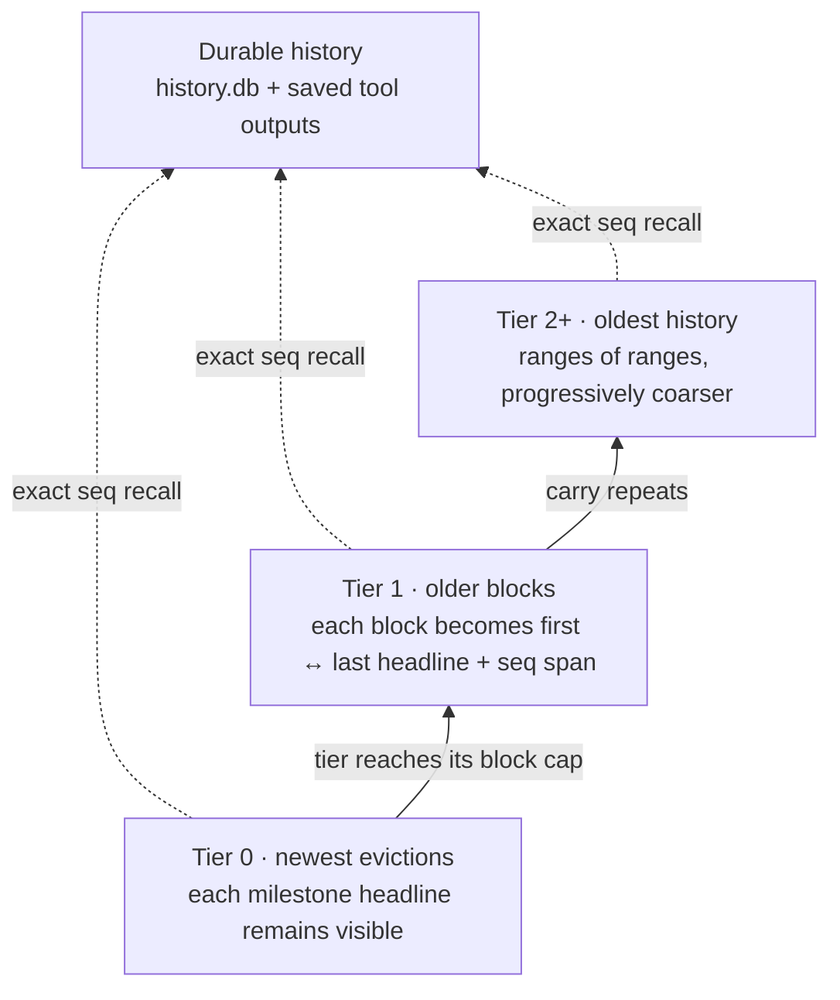

# Context as an Environment: Programmatic Context Management with QwenPaw Scroll

QwenPaw Scroll is designed for **long-context agentic tasks**. In these workloads, an agent must reason and act over a growing trajectory of user instructions, tool calls, tool results, failed attempts, decisions, and changing environment state. The central question is not only whether the model can recall an isolated fact, but how it can keep operating over session state that no longer fits inside the context window.

Context management for long-horizon agents is therefore an information-selection problem under a bounded inference budget. A common design injects relevant history directly into the prompt, then truncates or summarizes earlier content as the accumulated history approaches the context-window limit. This controls input size, but it also moves the retention decision to compaction time: the system must predict which details will remain useful before future queries are known.

QwenPaw Scroll uses a **CodeAct-style interface for context management**. Scroll writes interaction history through to durable storage and controls the live context with a recent tail, an eviction index, a continuation summary, and explicit recall. The structured `recall_history` tool runs only system-defined, parameterized read-only operations and therefore remains available without a sandbox. When a sandbox is available, Scroll also provides the more flexible `recall_history_python` environment, where an Agent-authored Python program operates through a pre-bound `ms` (`MemorySpace`) interface.

`recall_history_python` runs Agent-authored code in a sandboxed environment with a pre-bound `ms` interface. Durable history remains read-only, while a file-backed scratch database can retain derived tables for multi-step analysis. Stable `seq` addresses, `tool_call_id` values, and recovery metadata connect this query interface to history stored in SQLite and oversized tool output saved as files. The program filters and computes over externalized history, then returns only bounded evidence for the next reasoning step. The context window is therefore a working view over durable session history, not its container.

## 1. Interaction History Lives in the Event Log; Context Is a Working Set

Scroll separates two roles. **The context window is a bounded working set for the current reasoning step. The append-oriented Event Log in `history.db` is the durable source of truth for interaction history.** Oversized tool text can be saved under `tool_results/`, while the corresponding message retains a bounded preview and recovery metadata. Records and saved outputs remain accessible through stable database addresses, file pointers, and recall interfaces; Scroll does not materialize them as a universal Python object hierarchy.

If a summary becomes the only retained representation of historical content, every compaction performs an irreversible information-selection step. A precise error, a rejected implementation, or the date on which a preference changed may appear secondary at compaction time but become decisive evidence in a later session.

Scroll therefore separates the live prompt from durable history and query-time computation:



### The Event Log as the Historical Spine

Scroll represents the different event types in its append-only log through one `conversation_history` table. The table below shows the logical interface exposed to the Agent rather than the underlying SQL DDL:

| Field group | Key fields                                 | Purpose                                                                    |
| ----------- | ------------------------------------------ | -------------------------------------------------------------------------- |
| Addressing  | `seq`                                      | Provides a globally stable address for exact expansion and provenance      |
| Scope       | `session_id`, `agent_id`                   | Supports cross-session retrieval or explicit agent scoping                 |
| Event type  | `kind`, `role`, `name`                     | Distinguishes user/model turns from tool results and identifies tool names |
| Payload     | `content`, `blocks`                        | Stores inline text, structured blocks, or a bounded view of external data  |
| Tool state  | `tool_call_id`, `tool_input`, `tool_state` | Restores tool invocations, inputs, and execution state                     |
| Navigation  | `headline`                                 | Supplies compact retrieval labels to the eviction index                    |
| Time        | `created_at`                               | Enables date filters, range retrieval, and update resolution               |
| Recovery    | `metadata`, `dedup_key`                    | Stores payload pointers, recovery metadata, and idempotency keys           |

Small event payloads remain inline in SQLite. Before an oversized textual tool result is truncated for context, `ToolResultPruningMiddleware` saves the full raw output under `tool_results/` as a text file. The structured tool-result block retains a bounded preview together with block-scoped recovery metadata, including the file path and a `read_file` continuation hint. The persisted event therefore records what the model actually saw while preserving a route to the complete output.

The `seq` field is the stable address connecting durable history, the eviction index, summary provenance, and exact recall. FTS5 indexes only `content`; scope, event-type, and time fields support structured filtering. The structured `recall_history` tool handles search, span expansion, and exact tool-result recovery. When sandboxed execution is available, `recall_history_python` additionally provides an `ms` (`MemorySpace`) query surface for custom SQL, aggregation, and scratch tables. The schema retains original events rather than facts selected at ingestion time, so the Agent can choose the required view at query time.

The write path is append-oriented and persists across sessions. Keyword queries use FTS5 with BM25 ranking, with a slower `LIKE` fallback when FTS5 is unavailable. Under either retrieval backend, the live context can contract without affecting the durable event record or saved tool-output files.

## 2. CodeAct: Constructing Evidence at Query Time

The implemented mechanism is **using an Agent-authored program to construct the historical evidence needed by the next reasoning step**. Scroll does not route ordinary tools through this Python environment. Instead, tool calls and tool results produced by the normal agent loop are first recorded in `conversation_history`. If a textual result is oversized, the pruning middleware saves the full raw output to `tool_results/` and retains a preview plus recovery metadata in the message.

When that evidence later falls outside the live context, Scroll provides two recall interfaces. `recall_history` exposes bounded `expand`, `search`, `recall_tool`, and `days_between` operations implemented in advance as parameterized, read-only code, so it can operate even when no sandbox is available. Where sandboxed execution is available, Scroll additionally exposes `recall_history_python`: a more flexible programming environment over the same durable history.

### `ms`: A Controlled Interface in the Sandboxed Environment

`recall_history_python` pre-binds `ms`, exposing durable history read-only together with a separate writable scratch database. Its capability boundary is fixed and controlled, while the Agent can compose those capabilities with Python control flow, SQL, joins, aggregation, and data transformations:

| Interface                           | Current role                                                          |
| ----------------------------------- | --------------------------------------------------------------------- |
| `ms.expand(lo, hi)`                 | Reads an exact inclusive `seq` span                                   |
| `ms.search(...)`                    | Searches history and, when needed, saved large tool-output files      |
| `ms.recall_tool(tool_call_id)`      | Restores a tool call/result and reports any saved full-output file    |
| `ms.sessions()` / `ms.session(...)` | Discovers and reads session history                                   |
| `ms.sql_query(sql, params)`         | Runs custom reads over `hist.conversation_history` and scratch tables |
| `ms.sql_exec(sql, params)`          | Writes derived tables only to the persistent scratch database         |

The Agent can search, filter, join, and reduce historical rows within one program, then print only the bounded result needed by the model:

```python
events = ms.search("sale OR quote", k=200, include_turn=False)
selected = sorted(events, key=lambda row: row["seq"])[-20:]
for row in selected:
    print(row["seq"], row["content"][:1000])
```

Output is bounded and large results are truncated without a cursor, so the program must filter or page before returning evidence. For analysis that spans multiple calls, the Agent can write a derived table through `ms.sql_exec` and read it back later. Model-authored code normally runs only when a sandbox is available; the tool fails closed unless an operator explicitly enables the unsafe local fallback.

The current control loop is therefore: **identify missing historical evidence → run structured recall or a bounded Python recall program → return selected evidence to model context**. CodeAct contributes query-time programmability; Scroll supplies the durable Event Log, navigation, compression, and recovery substrate.

## 3. Headlines Compress Along the Time Axis

The Event Log preserves the interaction sequence, while recovery metadata preserves access to oversized tool output referenced by those events. But if keyword search were the only path after history leaves the live window, the Agent would have to anticipate the original wording and would still lack a compact view of task state and temporal position. Scroll therefore maintains a low-token navigation view over evicted history. A retrieval headline compresses each substantive turn into a semantic checkpoint and is later bound to a stable `seq`. The Agent can use the headline to locate a relevant span, then recover the original evidence by `seq`; full-text search remains a complementary recall path. QwenPaw asks the model to append a hidden retrieval headline after each substantive task response:

```text
⟦ model discovery | in progress: OpenAI done; next: fix DashScope | anchors: AllowlistFilter, registry.py ⟧
```

The model generates only the semantic content inside the brackets; it does not supply the address. After the turn is written to `history.db`, Scroll binds the headline to the stable `seq` assigned by the database. Once that turn leaves the live context, the eviction index renders it as:

```text
· seq 1842  ⟦ model discovery | in progress: OpenAI done; next: fix DashScope | anchors: AllowlistFilter, registry.py ⟧
```

The agent therefore sees both a semantic cue and its exact position in the original history. It can locate a checkpoint by headline, then pass its `seq` to `expand` to recover the corresponding turn; a collapsed block carries `seq lo-hi` for expanding the full span. Scroll creates this binding deterministically, so the model never has to generate or guess historical addresses.

The headline is neither a generic topic nor a summary of the whole conversation. It is a compact checkpoint for one turn:

- the stable task or success criterion;
- the latest verified state;
- a controlling decision, exact identifier, error, value, or artifact;
- the next unfinished action or blocker.

Its language distinguishes `completed`, `attempted`, `planned`, `failed`, `blocked`, `paused`, and `decided`. Compression must preserve the epistemic status of an event; a failed attempt cannot be represented as a completed result. When state changes, the headline retains the current effective value and marks the previous value as superseded when that distinction affects subsequent work.

The eviction index then uses **temporal distance as the compression axis**:



Each eviction adds a detailed block to Tier 0. When a tier reaches its cap, its newest block stays detailed while older blocks carry upward in collapsed form. A collapsed block keeps its sequence range and endpoint headlines. Recent history therefore retains finer representation granularity, while granularity decreases progressively with temporal distance.

The resulting loss applies to the **navigation view**, not to storage. An intermediate headline that is no longer displayed remains recoverable by expanding its retained `seq` span or searching the full log. The headline map locates the event; the recall layer restores the original turn or follows its saved-output metadata.

## 4. Externalization and Recovery Pipeline

After the context threshold is reached, QwenPaw applies a graduated pipeline ordered by recovery cost and information risk:

1. **Persist before modifying the live context.** Every live turn must be durable. If persistence fails, QwenPaw refuses to evict content that cannot be recovered.
2. **Fold completed tool results first.** Under normal context pressure, older persisted tool outputs can be replaced in-context by recovery pointers. The active turn and the five newest tool results remain protected, and a replacement occurs only when it yields positive space savings.
3. **Evict a safe middle.** The manager keeps a bounded recent tail and the complete active turn, then moves an older completed middle out of the prompt. Tool-call/result pairing is repaired at the boundary.
4. **Update two complementary compressed views.** The deterministic eviction index preserves navigation; the continuation summary preserves current task semantics.
5. **Recover under hard-limit pressure.** If completed turns are not enough, QwenPaw may fold old active-turn tool results only after a successful model request has already consumed them. Pending calls, unread results, and the current user request remain protected. If safe recovery is impossible, it raises an explicit context-unfit error instead of silently resetting the session.

The eviction index and continuation summary deliberately have different jobs:

| Layer                     | Purpose                         | Failure mode              | Recovery                                          |
| ------------------------- | ------------------------------- | ------------------------- | ------------------------------------------------- |
| Event log + saved outputs | Verbatim evidence               | Storage growth            | Retention policy / archival                       |
| Eviction index            | Cheap temporal navigation       | Older map becomes coarse  | Expand or search the `seq` span                   |
| Continuation summary      | Current task state              | Summary drift or omission | Validate, retain prior state, recall raw evidence |
| Recent tail               | Local conversational continuity | Bounded by window         | Evict only completed history                      |

## 5. Preventing Summary Snowballing

Recursive summary updates can accumulate error: an early omission or incorrect statement becomes input to the next update and may be reinforced across subsequent iterations. QwenPaw therefore defines the continuation summary as an **evidence-backed state cache**, never as the source of truth.

Several mechanisms limit drift:

- **Incremental update with conflict rules.** The previous summary is a baseline, but newly archived exact evidence wins when the two conflict; newer evidence wins when a fact changed over time.
- **Bounded, role-aware evidence.** User text and retrieval headlines receive priority. Tool results enter as limited previews and saved-output recovery metadata rather than unbounded payloads.
- **A fixed state schema.** The generated Markdown must contain `Active Task`, `Current State`, `Constraints`, `Decisions`, and `Open Work`, with one valid task status.
- **Provenance in code.** Summary items carry durable source spans. QwenPaw verifies that sequence endpoints still exist and that non-sequence pointers appeared in the supplied evidence.
- **Deterministic local quality checks.** The validator rejects malformed sections, missing sources, duplicate state items, possible secrets, invalid ranges, and identifiers that were not present in the evidence.
- **One repair attempt, then safe fallback.** A quality failure can trigger one repair prompt. Timeouts, provider failures, empty output, or a second invalid candidate preserve the previous valid summary instead of overwriting it.
- **No unsupported inheritance.** If the previous summary's durable source endpoints have expired, it is not silently reassigned to a newer range; QwenPaw drops that unsupported cache and builds fresh state from durable evidence.
- **Background-only semantics.** The injected summary explicitly cannot override the current live user request. Exact details must be recalled from history.

These safeguards do not make summarization lossless; they define its epistemic role. The summary maintains task continuity; `history.db` is authoritative for what occurred, and saved tool-output files preserve oversized raw text when pruning is required. A future periodic source-backed rebase can further reduce error propagation across long update chains without changing the underlying architecture.

## 6. Integrating External Semantic Long-Term Memory

Externalized interaction history provides recoverability and computation at the episodic layer, but it does not constrain QwenPaw's higher-level memory architecture. QwenPaw separates episodic history from semantic memory, so external semantic long-term memory can still be integrated through adapters, including graph, vector, ontology, and hybrid backends.

The two memory layers serve different roles:

| Dimension                | Externalized interaction history                               | External semantic long-term memory                               |
| ------------------------ | -------------------------------------------------------------- | ---------------------------------------------------------------- |
| Primary substrate        | Verbatim interaction events                                    | Derived entities, relations, concepts, and embeddings            |
| Natural query            | Exact recall, temporal filtering, aggregation, arbitrary joins | Semantic similarity, graph traversal, ontology, hybrid retrieval |
| When structure is chosen | At query time through structured recall or agent-authored code | During ingestion, indexing, and retrieval routing                |
| Best role                | Interaction provenance and unanticipated computation           | Connected knowledge, abstraction, cross-source semantic recall   |

The two layers can operate together within one system. Semantic long-term memory supports knowledge abstraction, semantic recall, and relational inference; Scroll supplies the recoverable event substrate and original evidence beneath it. An agent can retrieve an entity, concept, or relationship from the semantic layer, verify the corresponding Event Log record and, when needed, its saved tool output, then continue computing from that evidence. QwenPaw can therefore support different long-term memory implementations without changing Scroll's durable-history and context-management mechanisms.

## 7. Evaluation

We evaluate QwenPaw Scroll with **Qwen 3.8 Max** as the backbone on long-horizon tasks under context explosion. **LongMemEval_S** and **BEAM_10M** test whether information remains retrievable and usable for reasoning as history grows, while **LOCA_256K** tests whether context management can sustain end-to-end task completion as an agent's trajectory expands dynamically.

| Benchmark     |    Score |
| ------------- | -------: |
| LongMemEval_S | **94.8** |
| BEAM_10M      | **73.1** |
| LOCA_256K     | **86.7** |

With Qwen 3.8 Max, Scroll reaches **94.8** on **LongMemEval_S**, **73.1** on **BEAM_10M** (**+5.1 over previous SOTA**), and **86.7** on **LOCA_256K** (**+37.4 over previous SOTA**).

For implementation details and reproducible results, see the [QwenPaw Scroll Technical Report](https://arxiv.org/pdf/2608.21690).

## 8. Design Implications

The current implementation draws an executable boundary between model context and durable history:

- Scroll writes interaction history to `history.db` before evicting it from the live context;
- oversized textual tool results are byte-pruned for context and saved under `tool_results/` with recovery metadata;
- the recent tail, continuation summary, and eviction index form the bounded working set shown to the model;
- `recall_history` provides sandbox-independent structured recovery, while sandboxed deployments can additionally expose `recall_history_python` through a pre-bound `ms` surface;
- derived scratch tables can persist across recall steps, and only bounded results return to model context.

Context is therefore not a transcript that must remain resident. It is a bounded working view assembled from live turns, compact navigation and task state, and recalled evidence selected at query time. Scroll provides the durable-history and recovery substrate; its CodeAct-style recall interface lets the Agent compute over historical turns and saved tool outputs without expanding the entire record into the prompt. Together these mechanisms target more than isolated fact retrieval: they let an agent continue reasoning and acting as its trajectory grows beyond the current context window.

### References

- [Recursive Language Models](https://arxiv.org/abs/2512.24601)
- [LongMemEval](https://arxiv.org/abs/2410.10813)
- [BEAM](https://arxiv.org/abs/2510.27246)
- [LOCA-bench (LOCA_256K)](https://arxiv.org/abs/2602.07962)
