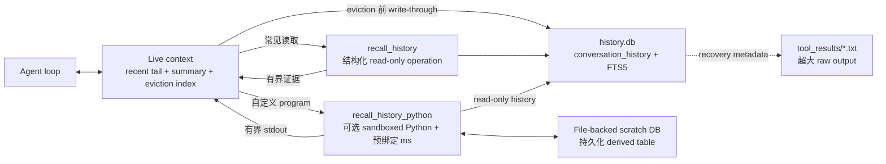
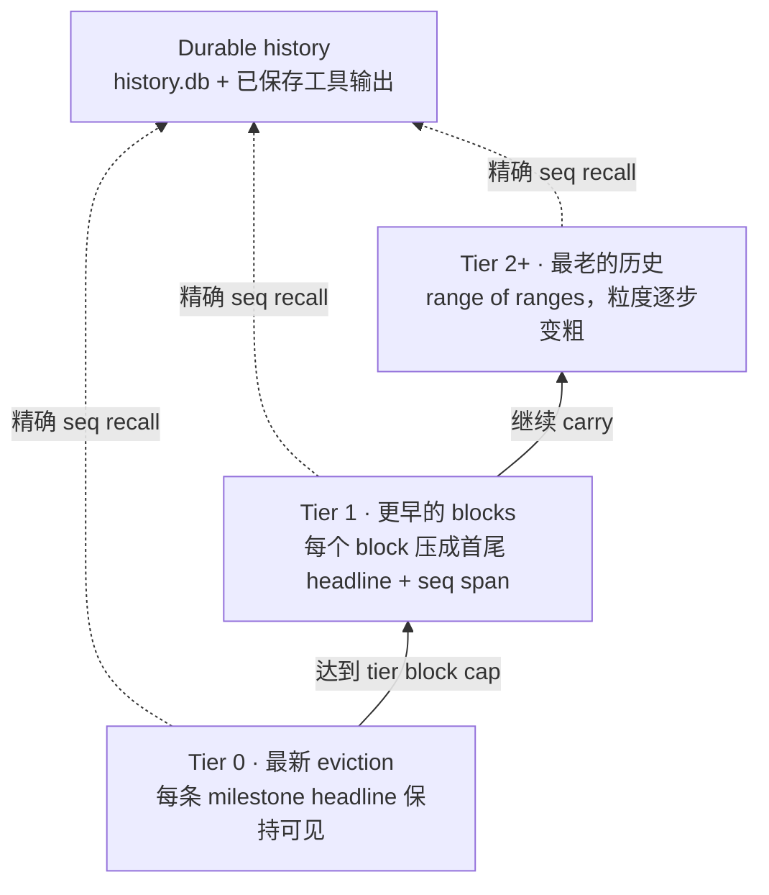

# 把上下文变成环境：QwenPaw Scroll 的程序化上下文管理

QwenPaw Scroll 面向的是 **long-context agentic tasks**。在这类任务中，Agent 需要在持续增长的 user instruction、tool call、tool result、失败尝试、决策与环境状态上连续推理并执行动作。核心问题不仅是能否从历史中 recall 某个事实，更是当 session state 已经无法装进 context window 时，模型如何仍然能够在这些状态之上持续工作。

因此，长时程 Agent 的上下文管理，本质上是在有限推理预算下选择模型当前可见的信息。常见实现会把相关历史直接注入 prompt；当累计历史接近上下文窗口上限时，再截断或摘要较早的内容。这类方法能够控制输入规模，但也把信息保留决策提前到了压缩时刻：系统必须在未来查询尚未出现时，预测哪些细节值得长期保留。

QwenPaw Scroll 将 **CodeAct 风格接口用于 context management**。Scroll 将交互历史 write-through 到 durable storage，并通过 recent tail、eviction index、continuation summary 和显式 recall 控制 live context。结构化 `recall_history` 只执行系统预先实现的参数化 read-only operation，因此在没有 sandbox 时仍然可用；当 sandbox 可用时，Scroll 还会提供更灵活的 `recall_history_python` environment，让 Agent 编写的 Python program 通过预绑定的 `ms`（`MemorySpace`）interface 操作历史。

`recall_history_python` 在 sandboxed environment 中运行 Agent 编写的代码，并预绑定 `ms` interface。Durable history 保持 read-only，file-backed scratch database 则可以为多步分析保留 derived table。稳定的 `seq`、`tool_call_id` 和 recovery metadata 将这个 query interface 与 SQLite 中的历史、以及保存为文件的超大工具输出连接起来。Program 在 externalized history 上完成筛选和计算，然后只返回下一步推理所需的有界证据。因此，context window 是 durable session history 之上的 working view，而不是它的容器。

## 1. 交互历史存在 Event Log 中，Context 是 Working Set

Scroll 将两种角色明确分开：**context window 是服务于当前推理步骤的有界 working set；`history.db` 中以追加为主的 Event Log 是交互历史的 durable source of truth。** 超大工具文本可以保存到 `tool_results/`，对应消息则保留有界 preview 和 recovery metadata。记录和已保存输出通过稳定数据库地址、文件指针与 recall interface 保持可访问，但不会被 materialize 成一套统一的 Python object hierarchy。

如果 summary 成为历史内容唯一保留的表示，那么每次压缩都隐含了一次不可逆的信息选择：系统需要预先判断未来不会再依赖哪些细节。然而，一条精确报错、一个被否决的实现方案，或某项偏好发生变化的具体日期，都可能在后续 session 中成为关键证据。

因此，Scroll 把 live prompt、durable history 与 query-time computation 分开：



### Event Log：Durable History 的主干

Scroll 通过一张 `conversation_history` 表表示 append-only log 中的不同 event 类型。下表展示暴露给 Agent 的逻辑接口，而不是底层 SQL DDL：

| 字段组     | 关键字段                                   | 作用                                                |
| ---------- | ------------------------------------------ | --------------------------------------------------- |
| Addressing | `seq`                                      | 提供全局稳定地址，用于精确展开与 provenance         |
| Scope      | `session_id`, `agent_id`                   | 支持跨 session 检索，也可以限定到指定 Agent         |
| Event type | `kind`, `role`, `name`                     | 区分 user/model turn 与 tool result，并标识工具名称 |
| Payload    | `content`, `blocks`                        | 保存内联文本、结构化 block 或外部数据的有界 view    |
| Tool state | `tool_call_id`, `tool_input`, `tool_state` | 精确恢复工具调用、输入及执行状态                    |
| Navigation | `headline`                                 | 为 eviction index 提供紧凑的 retrieval label        |
| Time       | `created_at`                               | 支持日期过滤、时间范围检索和事实更新判断            |
| Recovery   | `metadata`, `dedup_key`                    | 保存 payload pointer、恢复信息与幂等写入标识        |

较小的 event payload 直接内联在 SQLite 中。超大的文本 tool result 在为 context 截断之前，`ToolResultPruningMiddleware` 会先把完整 raw output 以文本文件形式保存到 `tool_results/`。结构化的 tool-result block 保留有界 preview 和 block-scoped recovery metadata，其中包括文件路径和继续通过 `read_file` 读取的提示。因此，持久化 event 记录模型实际看到的内容，同时保留恢复完整输出的路径。

其中，`seq` 是连接 durable history、eviction index、summary provenance 与精确 recall 的稳定地址。FTS5 只对 `content` 建立全文索引；scope、event type 与时间字段则用于结构化过滤。Search、span expand 和精确 tool-result recovery 由结构化 `recall_history` 完成；当 sandboxed execution 可用时，`recall_history_python` 还会通过 `ms`（`MemorySpace`）query surface 支持自定义 SQL、aggregation 和 scratch table。Schema 保留的是原始 event，而不是在写入阶段预先提取的“重要事实”，因此 Agent 可以在 query time 选择当前任务所需的 view。

写入路径以追加为主，并跨 session 持久化。关键词查询使用 FTS5 的 BM25 排序；环境不支持 FTS5 时，则降级为较慢的 `LIKE` 扫描。无论采用哪种检索 backend，live context 都可以受控收缩，而 durable event record 和已保存的工具输出文件不受影响。

## 2. CodeAct：在 Query Time 构造证据

当前实现的核心机制是：**由 Agent 编写 program，构造下一步推理所需的历史证据**。Scroll 不会把普通工具路由进这个 Python environment。普通 agent loop 产生的 tool call 和 tool result 会先写入 `conversation_history`；如果文本结果过大，pruning middleware 会把完整 raw output 保存到 `tool_results/`，并在消息中保留 preview 与 recovery metadata。

当相关证据离开 live context 后，Scroll 提供两种 recall interface。`recall_history` 将 `expand`、`search`、`recall_tool` 与 `days_between` 预先实现为有界、参数化的 read-only operation，因此即使没有 sandbox 也可以使用。当 sandboxed execution 可用时，Scroll 还会额外提供 `recall_history_python`：同一份 durable history 之上更灵活的程序化执行环境。

### `ms`：Sandboxed Environment 中的受控接口

`recall_history_python` 会预绑定 `ms`，以 read-only 方式暴露 durable history，同时提供独立的 writable scratch database。它的 capability boundary 固定且受控，但 Agent 可以在这个边界内使用 Python control flow、SQL、join、aggregation 和数据变换自由组合这些能力：

| Interface                           | 当前作用                                                     |
| ----------------------------------- | ------------------------------------------------------------ |
| `ms.expand(lo, hi)`                 | 读取精确的 inclusive `seq` span                              |
| `ms.search(...)`                    | 搜索历史，并在需要时搜索已保存的大型工具输出文件             |
| `ms.recall_tool(tool_call_id)`      | 恢复 tool call/result，并报告已保存的完整输出文件            |
| `ms.sessions()` / `ms.session(...)` | 发现并读取 session history                                   |
| `ms.sql_query(sql, params)`         | 在 `hist.conversation_history` 与 scratch table 上自定义读取 |
| `ms.sql_exec(sql, params)`          | 只向 persistent scratch database 写入 derived table          |

Agent 可以在一次 program 中对历史记录执行 search、filter、join 和 reduce，然后只 print 模型真正需要的有界结果：

```python
events = ms.search("sale OR quote", k=200, include_turn=False)
selected = sorted(events, key=lambda row: row["seq"])[-20:]
for row in selected:
    print(row["seq"], row["content"][:1000])
```

输出有明确上限，过大结果会被截断且没有 cursor，因此 program 必须在返回证据前完成 filter 或 pagination。对于跨多次 recall 的分析，Agent 可以通过 `ms.sql_exec` 写入 derived table，并在后续调用中重新读取。模型生成的代码通常只在 sandbox 可用时运行；除非 operator 明确开启不安全的本地 fallback，否则该工具会 fail closed。

当前控制循环因此是：**识别缺失的历史证据 → 执行 structured recall 或有界 Python recall program → 将选中的证据返回 model context**。CodeAct 提供 query-time programmability，Scroll 则提供 durable Event Log、导航、压缩与恢复 substrate。

## 3. Headline：沿时间轴进行信息压缩

Event Log 保存完整的交互序列，recovery metadata 则保持对超大工具输出的访问。但如果历史移出 live window 后只剩关键词搜索，Agent 必须预先猜中原始措辞，也难以从搜索结果中理解任务状态与时间位置。Scroll 因此为已经移出窗口的历史维护一个 token 开销较低的 navigation view：retrieval headline 将每个包含实质任务信息的 turn 压缩成语义 checkpoint，并在持久化后与稳定 `seq` 绑定。Agent 可以先通过 headline 定位相关区段，再按 `seq` 恢复原始证据；全文搜索则作为互补的 recall 路径。QwenPaw 会要求模型在每个包含实质任务信息的回复后，追加一条对用户隐藏的 retrieval headline：

```text
⟦ 模型发现修复｜进行中：OpenAI 已完成；下一步：修复 DashScope｜锚点：AllowlistFilter、registry.py ⟧
```

模型只生成括号内的语义内容，不自行填写地址。Turn 写入 `history.db` 后，Scroll 会把数据库分配的稳定 `seq` 与 headline 绑定；当该 turn 被移出 live context 时，它会在 eviction index 中呈现为：

```text
· seq 1842  ⟦ 模型发现修复｜进行中：OpenAI 已完成；下一步：修复 DashScope｜锚点：AllowlistFilter、registry.py ⟧
```

因此，Agent 看到的不只是一个语义提示，还包括它在原始历史中的确定位置。Agent 可以先根据 headline 找到相关 checkpoint，再以 `seq` 调用 `expand` 恢复对应 turn；折叠后的 block 则携带 `seq lo-hi`，用于展开整个区间。这一绑定由系统完成，避免模型生成或猜测历史地址。

Headline 既不是宽泛的话题标签，也不是整个历史区间的 summary，而是一个 turn 的紧凑 checkpoint：

- 稳定的任务名或成功标准；
- 本轮最新、已验证的状态；
- 控制后续行为的决定、精确 identifier、error、数值或 artifact；
- 尚未完成的下一步或 blocker。

它必须区分“已完成、尝试过、计划中、失败、阻塞、暂停、已决定”。压缩不能改变事件的认知状态，例如不能把失败尝试表示为完成结果。当状态随时间变化时，headline 保留当前有效值；如果新旧差异会影响后续动作，则明确标记旧值已经 superseded。

接下来，eviction index 以**时间距离作为表示压缩轴**：



每次 eviction 会在 Tier 0 增加一个保留完整 headline 的 block。当某一 tier 达到容量上限，新 block 保持详细，较早的 blocks 则 collapse 后向上一层 carry。Collapse 会保留整个 `seq` range，以及 block 的首尾 headline。因此，近期历史具有较细的表示粒度；随着时间距离增加，索引逐步转化为更粗粒度的区间表示。

这里有损的是**导航视图**，而不是底层存储。中间 headline 即使不再直接显示，仍可以通过保留的 `seq` span 展开，或在完整日志中搜索。Headline map 用于定位 event，recall layer 用于恢复原始 turn 或沿 saved-output metadata 访问完整内容。

## 4. 外部化与恢复流程

达到 context threshold 后，QwenPaw 不会立即 summarize 整段对话，而是按照恢复成本与信息风险分级处理：

1. **先持久化，再调整 live context。** Live turn 必须先写入 durable store。如果写入失败，QwenPaw 会拒绝 eviction，避免生成指向不存在记录的 recovery pointer。
2. **优先折叠 completed tool result。** 在常规 context pressure 下，较早且已经持久化的工具输出可以在 context 中替换成恢复指针。完整 active turn 与最新五个 tool result 受到保护；仅当替换能够降低上下文占用时才执行。
3. **安全驱逐中间区段。** Manager 保留有界 recent tail 和完整 active turn，将更早的 completed middle 移出 prompt，并修复边界处的 tool-call/result pairing。
4. **更新两种互补的压缩视图。** 确定性的 eviction index 负责导航；continuation summary 负责当前任务语义。
5. **只在 hard limit 下回收 active turn。** 如果 completed turn 已经不足以释放空间，只会折叠那些已被一次成功 model request 消费过的旧 active-turn tool result。Pending call、未读结果和当前 user request 仍然受保护。如果再无安全恢复方式，系统抛出明确的 context-unfit error，而不是静默 `/new` 或清空 session。

Eviction index 与 continuation summary 刻意承担不同工作：

| Layer                     | 作用           | 可能的退化               | 恢复方式                       |
| ------------------------- | -------------- | ------------------------ | ------------------------------ |
| Event log + saved outputs | 逐字证据       | 存储持续增长             | Retention policy / archive     |
| Eviction index            | 低开销时间索引 | 旧 map 粒度变粗          | 展开或搜索 `seq` span          |
| Continuation summary      | 当前任务状态   | Summary drift / omission | 校验、保留旧状态、恢复原始证据 |
| Recent tail               | 局部对话连续性 | 受窗口大小限制           | 只 eviction completed history  |

## 5. 多重 Summarization & Update 机制如何防止 Snowballing

递归更新 summary 容易产生误差累积：早期遗漏或错误会成为下一次 update 的输入，并在后续迭代中逐步固化。QwenPaw 因此把 continuation summary 定义为**由证据支撑的 state cache**，而不是 source of truth。

当前实现用多重机制限制 drift：

- **增量更新 + 冲突规则。** Previous summary 只是 baseline。它与本轮新归档的精确证据冲突时，以 source evidence 为准；事实随时间变化时，以较新的证据为准。
- **有界、role-aware 的输入。** User text 与 retrieval headline 优先；tool result 只提供有限 preview 与 saved-output recovery metadata，避免大规模工具输出占用任务状态的输入预算。
- **固定状态 schema。** 生成的 Markdown 必须包含 `Active Task`、`Current State`、`Constraints`、`Decisions` 和 `Open Work`，并提供一个合法 task status。
- **由代码管理 provenance。** 每个 summary item 带 durable source span。系统检查 seq endpoint 是否仍然存在，非 seq pointer 是否真的出现在输入证据中。
- **确定性的本地质量检查。** Validator 会拒绝 section 格式错误、缺少 source、重复状态、疑似 secret、非法 range，以及输入 evidence 中从未出现过的 identifier。
- **最多修复一次，然后安全降级。** Quality failure 可以触发一次 repair prompt。Timeout、provider failure、空输出，或第二次非法 candidate，都不会覆盖上一份有效 summary。
- **不继承已经失去依据的状态。** Previous summary 的 durable source endpoint 如果已经过期，QwenPaw 不会把它静默绑定到一个更新的范围，而是丢弃这份 unsupported cache，并从仍然持久化的证据重新构建状态。
- **明确的 background-only 语义。** 注入的 summary 不能覆盖当前 live user request；精确细节仍必须从 history recall。

这些 safeguard 不会使 summarization 成为无损过程，但会明确其证据角色：summary 用于维持任务连续性；`history.db` 是“发生过什么”的权威记录；需要 pruning 时，已保存的工具输出文件则保留超大 raw text。未来还可以加入周期性的 source-backed rebase，进一步降低超长 update chain 中的误差传播，而不改变底层架构。

## 6. 仍然可以外接 Semantic Long-Term Memory

Externalized interaction history 解决的是 episodic layer 的可恢复性与可计算性，但它并不限定 QwenPaw 上层的 memory architecture。QwenPaw 将 episodic history 与 semantic memory 分层，因此仍然可以通过适配接口接入外部 semantic long-term memory，包括 graph、vector、ontology 或多种索引组合而成的 hybrid backend。

两层 memory 的职责不同：

| 维度           | Externalized interaction history                 | External semantic long-term memory                    |
| -------------- | ------------------------------------------------ | ----------------------------------------------------- |
| 主要 substrate | 逐字交互事件                                     | 派生出的 entity、relation、concept 与 embedding       |
| 自然查询方式   | 精确 recall、时间 filter、aggregate、任意 join   | 语义相似度、关系遍历、ontology query 与 hybrid recall |
| 结构何时确定   | Query time，通过 structured recall 或 Agent code | ingestion、indexing 与 retrieval routing 阶段         |
| 最适合的角色   | Interaction provenance 与未预见计算              | Connected knowledge、抽象与跨来源语义召回             |

两层可以在同一系统中协同工作。Semantic long-term memory 负责知识抽象、语义召回和关系推断；Scroll 在下层提供可恢复的 event substrate 与原始证据。Agent 可以先从 semantic layer 检索实体、概念或关系，再验证对应的 Event Log record，并在需要时读取已保存的工具输出，然后继续计算。由此，QwenPaw 可以扩展不同的长期记忆实现，而无需改变 Scroll 的持久历史与 context management 机制。

## 7. Evaluation

我们使用 **Qwen 3.8 Max** 作为 backbone，评估 QwenPaw Scroll 在 context explosion 下执行长程任务的效果。**LongMemEval_S** 与 **BEAM_10M** 检验历史持续增长后，关键信息能否被准确取回并用于推理；**LOCA_256K** 则检验 agent trajectory 动态增长时，context management 能否维持 end-to-end task completion。

| Benchmark     |    Score |
| ------------- | -------: |
| LongMemEval_S | **94.8** |
| BEAM_10M      | **73.1** |
| LOCA_256K     | **86.7** |

使用 Qwen 3.8 Max，Scroll 在 **LongMemEval_S** 上达到 **94.8**，在 **BEAM_10M** 上达到 **73.1**（**比此前 SOTA 高 5.1**），并在 **LOCA_256K** 上达到 **86.7**（**比此前 SOTA 高 37.4**）。

具体的实现细节和可复现结果，请参阅 [QwenPaw Scroll Technical Report](https://arxiv.org/pdf/2608.21690)。

## 8. Design Implications

当前实现让 model context 与 durable history 之间形成一条可执行边界：

- Scroll 在从 live context eviction 之前，先把交互历史写入 `history.db`；
- 超大的文本 tool result 会按 byte 为 context 截断，并保存到 `tool_results/`，同时记录 recovery metadata；
- recent tail、continuation summary 与 eviction index 共同构成模型看到的有界 working set；
- `recall_history` 提供不依赖 sandbox 的结构化恢复；在支持 sandboxed execution 的部署中，还可以通过预绑定 `ms` 的 `recall_history_python` 提供程序化恢复；
- derived scratch table 可以跨 recall step 持久化，只有有界结果返回 model context。

因此，context 不是必须常驻的 transcript，而是由 live turn、紧凑导航与任务状态，以及 query time 选中的 recall evidence 共同组成的有界 working view。Scroll 提供 durable history 与 recovery substrate；它的 CodeAct 风格 recall interface 让 Agent 在不把整份记录展开进 prompt 的情况下，对历史 turn 和已保存工具输出执行计算。这些机制共同服务的不只是孤立事实检索，而是让 Agent 在 trajectory 超出当前 context window 后仍能持续推理和行动。

### References

- [Recursive Language Models](https://arxiv.org/abs/2512.24601)
- [LongMemEval](https://arxiv.org/abs/2410.10813)
- [BEAM](https://arxiv.org/abs/2510.27246)
- [LOCA-bench（LOCA_256K）](https://arxiv.org/abs/2602.07962)
