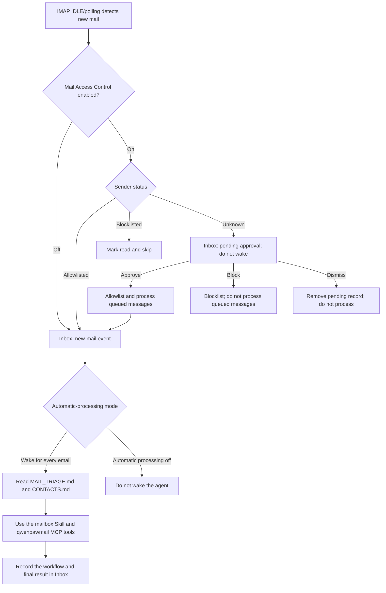

# Mailbox Management and Automation

QwenPaw can connect a separate mailbox to each agent and use IMAP/SMTP to
receive, search, send, reply to, forward, download attachments from, and organize
email. It can also group messages into threads and analyze mailbox activity.
When automatic new-mail handling is enabled, the agent intelligently processes
incoming messages, learns new workflows and user preferences over time, and
progressively manages the user's mailbox end to end.

Two components work together to provide mailbox management:

- **qwenpawmail MCP** provides 22 tools for reliably reading from and writing to
  the real mailbox.
- The **mailbox Skill** defines account setup, tool selection, contact
  maintenance, automatic triage, and safety boundaries.

> Mailbox management is available only with the native QwenPaw backend.
> Third-party agent backends cannot be given mail configuration. Each agent has
> its own isolated credentials, monitor state, thread index, contacts, triage
> rules, and access-control lists.

## Before You Start

1. Make sure **IMAP/SMTP** is enabled with your mail provider.
2. Obtain the authorization code, app password, or mailbox login password
   required by the provider. Credential requirements vary; do not assume your
   regular account password will work.
3. New installations include qwenpawmail MCP. In a source checkout, run
   `make install-dev` from the repository root. If QwenPaw is already installed
   but the mail package is missing, run `make install-mail-mcp`. The Docker image
   installs the mail package with the main project.
4. In **Settings → Skill Pool**, make sure the built-in `mailbox` Skill is up to
   date. Then open **Workspace → Skills** for the target agent, load the Skill,
   and enable it. If you are upgrading from an older version, update the Skill
   Pool so that `mailbox` replaces the deprecated `himalaya` Skill.

After you save the mail configuration, QwenPaw automatically creates and enables
the `qwenpawmail` MCP driver card and initializes the mail files in the agent's
workspace. You do not need to start the MCP server separately. New driver cards
use the **ask** policy for mail tools by default. In **Workspace → MCP**, you can
adjust access policy by tool and call origin. Later mail-configuration changes
preserve any driver enabled state, tool scope, and access policy you have already
set.

## Supported Mail Providers

QwenPaw's managed mailbox workflow currently supports these nine personal-mail
domains:

| Mail domain   | Provider             | Required credential             | IMAP / SMTP                                   |
| ------------- | -------------------- | ------------------------------- | --------------------------------------------- |
| `163.com`     | NetEase 163          | 16-character authorization code | `imap.163.com:993` / `smtp.163.com:465`       |
| `126.com`     | NetEase 126          | 16-character authorization code | `imap.126.com:993` / `smtp.126.com:465`       |
| `yeah.net`    | NetEase yeah.net     | 16-character authorization code | `imap.yeah.net:993` / `smtp.yeah.net:465`     |
| `qq.com`      | QQ Mail              | 16-character authorization code | `imap.qq.com:993` / `smtp.qq.com:465`         |
| `foxmail.com` | QQ Mail alias domain | 16-character authorization code | `imap.qq.com:993` / `smtp.qq.com:465`         |
| `sina.com`    | Sina Mail            | 16-character authorization code | `imap.sina.com:993` / `smtp.sina.com:465`     |
| `sina.cn`     | Sina Mail            | 16-character authorization code | `imap.sina.cn:993` / `smtp.sina.cn:465`       |
| `aliyun.com`  | Aliyun Mail          | Mailbox login password          | `imap.aliyun.com:993` / `smtp.aliyun.com:465` |
| `gmail.com`   | Gmail                | 16-character app password       | `imap.gmail.com:993` / `smtp.gmail.com:465`   |

The managed QwenPaw workflow does not currently support enterprise mail,
custom domains, or Microsoft mailboxes.

> The qwenpawmail MCP package can also run independently of QwenPaw. In a
> standalone deployment, use `QWENPAWMAIL_IMAP_HOST`,
> `QWENPAWMAIL_IMAP_PORT`, `QWENPAWMAIL_SMTP_HOST`, and
> `QWENPAWMAIL_SMTP_PORT` to connect explicitly to another server.

## Connect Your Personal Mailbox

### 1. Get the Right Client Credential

Sign in to the provider's web interface, enable IMAP/SMTP in the account,
client, or security settings, and generate the required credential:

- NetEase, QQ, and Sina Mail use a provider-generated 16-character
  authorization code.
- Gmail requires 2-Step Verification and a 16-character app password.
- Aliyun Mail uses the mailbox login password.

An authorization code grants full send and receive access. Protect it like a
password. Enter it only in the agent configuration UI whenever possible; do not
paste it into chat, documentation, or logs. Changing the account password,
revoking the authorization code, or disabling IMAP/SMTP can invalidate an
existing credential.

QwenPaw never writes credentials in plaintext to `agent.json` or the MCP driver
card. Public mail configuration is stored in `agent.json`; secrets are encrypted
in the workspace's `credentials.yaml` and resolved through a credential
reference only when the MCP subprocess starts. Neither the Agent API nor the
agent can read these secrets. The absence of an `auth_code` field from public
configuration does not mean a credential has not been configured.

### 2. Configure Mail on the Agent

- Open **Settings → Agent Management** and create or edit a QwenPaw agent.
- Under **Email Management**, select **Manage your personal mailbox**.
- Enter the mailbox local part and domain. For example, `alex` + `163.com`
  becomes `alex@163.com`.
- Enter the authorization code, app password, or mailbox login password.
- Choose how to handle new mail automatically:
  - **Off**: manage the mailbox only when requested in chat; do not monitor new
    mail.
  - **Wake for every email**: monitor every new message and let the agent decide
    how to handle it using the triage tree.
- After selecting **Wake for every email**, optionally enable **Mail Access
  Control**. When enabled, messages from unknown senders require approval first.
- Save the agent.

Mail configuration applies only to the current agent. Third-party backends do
not support it, and mail capability is not copied when an agent is duplicated as
a third-party-backend agent.

### 3. Verify Receiving and Sending

Send this message in the configured agent's chat:

```text
Check my mailbox authentication and list all mail folders.
```

The agent should call `check_auth` first, using fresh connections to verify IMAP
and SMTP separately, and then call `list_folders`. Verify both before enabling
automatic processing: being able to receive mail does not necessarily mean
sending works.

## Register a Dedicated Agent Mailbox

**Provision a dedicated mailbox** is a guided workflow. Saving the agent records
the intent to register an account; it does not immediately create one. Account
registration still takes place on the provider's website.

- In **Settings → Agent Management**, select **Provision a dedicated mailbox**.
- Choose a mail domain and, optionally, enter your preferred mailbox name. If
  left blank, the agent uses `create_mailbox` to generate a valid random name.
- You can leave the credential blank at this point. Save the agent, open its
  chat, and ask it to “register and connect a dedicated mailbox for itself.”
- The agent first opens the provider's registration page in the browser. When
  prompted for a password, phone number, image or SMS verification code, slider,
  or agreement confirmation, complete the required manual steps directly on the
  page. QwenPaw does not save this registration information.
- After registration, enable IMAP/SMTP in the provider settings, generate an
  authorization code, and verify send and receive access.
- Reopen the agent configuration, keep **Provision a dedicated mailbox**
  selected, enter the final mailbox name and credential, and save. QwenPaw
  automatically changes `is_new_account` to `false`, encrypts the secret,
  synchronizes the managed DriverCard, and reloads the agent.

The provider's registration page is the final authority on name availability.

## Manage Email in Chat

After setup, use natural language to assign mail-management tasks. For example:

```text
List the latest 10 inbox messages with sender, subject, and date only.
Find messages from the last 30 days whose subjects contain "contract" and summarize the action items.
Save every attachment from this message to attachments/contract-review/.
Reply that I am free Wednesday afternoon, but show me the draft before sending.
Mark these three messages as read and move them to Archive.
List unanswered customer messages by thread and calculate my average response time for the last 14 days.
```

New qwenpawmail driver cards use the `ask` policy by default, so tool calls are
sent for user approval. For automatic processing, you can set an `allow` policy
for specific low-risk tools or trusted call origins that require it.

> Recommendation: do not unconditionally allow high-risk operations such as
> deletion or sending mail externally merely to avoid approvals.

## Supported Mailbox Operations

qwenpawmail MCP provides 22 tools.

### Read-Only Tools (11)

| Tool                | Description                                                                                              |
| ------------------- | -------------------------------------------------------------------------------------------------------- |
| `check_auth`        | Verify IMAP and SMTP login separately; call this first after setup                                       |
| `list_folders`      | List all folders and decode modified UTF-7 names                                                         |
| `list_messages`     | Page through envelope metadata, newest first by default, without reading bodies; maximum 100             |
| `get_message`       | Get text/HTML bodies and attachment metadata by folder and UID; does not return attachment content       |
| `get_attachment`    | Get an attachment by name or zero-based index, returning base64 or saving it to the workspace            |
| `search_messages`   | Combine body keywords, sender, and date range when searching a specified folder                          |
| `create_mailbox`    | Validate or generate a NetEase/Tencent name and return registration guidance; does not create an account |
| `list_threads`      | Incrementally sync, then filter threads by labels, sender, recipient, subject, and date                  |
| `search_threads`    | Search Inbox and Sent content and map matches to threads, excluding Trash and Spam                       |
| `get_thread`        | Return envelope metadata in chronological order; use `get_message` to retrieve message bodies            |
| `get_mailbox_stats` | Analyze recent volume, contacts, trends, response times, pending replies, and attachments                |

### Write Tools (9)

| Tool                | Description                                                                                               |
| ------------------- | --------------------------------------------------------------------------------------------------------- |
| `send_message`      | Send a plain-text message with `to`, `cc`, and `bcc`                                                      |
| `reply_message`     | Reply with `In-Reply-To`, `References`, and a `Re:` subject prefix set automatically                      |
| `forward_message`   | Forward a message with the original attached as RFC 822 and a `Fwd:` subject prefix                       |
| `mark_messages`     | Mark messages read, unread, flagged, or unflagged in a batch                                              |
| `move_message`      | Move a message, first attempting to create the destination folder if it does not exist                    |
| `create_folder`     | Create a folder, encoding names as modified UTF-7; safe to retry if the folder already exists             |
| `set_credentials`   | Temporarily override credentials in the current MCP process; unknown domains also require IMAP/SMTP hosts |
| `clear_credentials` | Clear temporary credentials; the next call falls back to managed startup credentials, if present          |
| `update_thread`     | Add or remove custom thread labels; system labels cannot be changed                                       |

### Destructive Tools (2)

| Tool             | Description                                                                                         |
| ---------------- | --------------------------------------------------------------------------------------------------- |
| `delete_message` | Mark one UID as `\Deleted` and, when supported, expunge only that UID                               |
| `delete_thread`  | Move each message in a thread to the automatically detected Trash folder and update the local index |

A message UID is valid only within its folder. After moving a message, list the
destination folder again instead of reusing the old UID from the source folder.
Confirm the target before calling `delete_message` or `delete_thread`.
Automatic triage is prohibited from calling `delete_message`.

Relative attachment paths resolve from the agent workspace, and absolute paths
must also remain inside the workspace. Neither `..` nor symbolic links can
escape the workspace boundary. A path ending in `/` is treated as a directory,
which is created before saving the attachment under its original filename.

## Threads, Labels, and Statistics

Thread tools use a local JSON index, but the mailbox server remains the source
of truth:

- Messages are grouped first by `References` and `In-Reply-To`. If those headers
  are absent, grouping falls back to participants plus a subject normalized by
  removing prefixes such as `Re:`, `Fwd:`, `回复:`, and `转发:`.
- The first sync reads Inbox and the automatically detected Sent folder, up to
  500 messages from the last 90 days in each folder.
- Later syncs are incremental by UID. When the provider changes `UIDVALIDITY`,
  the old index for that folder is cleared and the initial synchronization
  window is rebuilt so that stale UIDs cannot point to the wrong messages.
- `list_threads` returns at most 100 results and can filter by all specified
  labels, sender, recipient, subject, and date.
- `inbox`, `sent`, `spam`, and `trash` are read-only system labels derived from
  message location. `update_thread` manages only custom labels.
- `search_threads` searches Inbox and Sent, ranks by match count and recency,
  and explicitly excludes Spam and Trash. If the provider does not support
  full-text search, it falls back to local subject matching over synchronized
  threads.
- `get_mailbox_stats` accepts a 1–365-day window and scans at most 1,000 messages
  per folder. `truncated: true` means that this cap may affect completeness.

Statistics include total received and sent mail, unread and flagged counts, the
top 10 senders and recipients, daily trends, mean and median response times,
threads awaiting a reply, messages with attachments, and the five largest
messages. The thread index is a rebuildable cache, not a mailbox backup. After a
message is moved, deleted, or changed in another client, query the server again
to confirm the result.

## Automate New Mail

With **Wake for every email** selected, QwenPaw monitors `INBOX`. It prefers IMAP
IDLE when the provider supports it. If IDLE is unsupported or fails three times
in a row, QwenPaw falls back to polling. The default polling interval is 120
seconds, with a runtime minimum of 10 seconds.

The IDLE connection is rebuilt periodically: every 25 minutes for most
providers. Because IDLE delivery is unreliable with QQ and Foxmail, QwenPaw
actively checks for new mail at least every two minutes even if the server sends
no `EXISTS` notification. Network errors use exponential backoff, with retries
delayed by at most 60 seconds.

The processing pipeline is:

1. If Mail Access Control is enabled, use the sender identity authenticated by
   the receiving provider to check the allowlist, blocklist, and pending state.
2. Publish a new-mail event and body preview to the Console **Inbox**.
3. Decide whether to wake the agent according to the automatic-processing mode.
4. Have the agent read `MAIL_TRIAGE.md` and `CONTACTS.md` before classifying,
   organizing, extracting, or communicating.
5. Publish the final summary and tool execution trace back to Inbox as an
   `auto_handled` event. Timeouts and failures also leave an error event.



On its first start, the monitor records only the newest current UID as its
baseline and does not process historical messages. If Inbox is empty at startup,
the first message that arrives later is processed normally. Switching mailboxes
or detecting a `UIDVALIDITY` change also establishes a new baseline so that mail
from the old mailbox or UID space is not mistaken for new mail.

For each message, automation fetches at most the first 64 KiB and includes about
2,000 characters as a body preview. Attachments are not downloaded as body text.
Plain text is preferred; when only HTML is available, readable text is extracted.

### Agent Mail-Handling Rules and Workflow

1. When the agent wakes, it consults `MAIL_TRIAGE.md` and `CONTACTS.md` before
   formulating its mail-management strategy:
   - `MAIL_TRIAGE.md` is the agent's mail-triage playbook. You can view and edit
     it in **Workspace → Files**. Its default policy covers:
     - **Category A:** mailbox-state operations such as marking read, archiving,
       flagging, and isolating spam;
     - **Category B:** information extraction such as updating registers, saving
       attachments, and recording contacts;
     - **Category C:** time-sensitive work such as reminders, calendars, travel,
       and shipment tracking;
     - **Category D:** replies, continuing threads, forwarding, and sending new
       messages to known contacts;
     - **Category E:** one-time results such as extracting verification codes;
     - **Category F:** F1 exploration for messages that cannot be classified,
       have low-confidence matches, require irreversible actions, or require
       following a link in the message.
   - `CONTACTS.md` stores known contacts and relationship context. Automatic
     outbound mail may be sent only to a known contact or the sender of the
     original message. For money, commitments, or sensitive relationships, the
     agent should prepare a draft and ask for confirmation.
2. The agent matches each new message's recognition criteria from top to bottom
   in the triage tree. On a match, it runs the prescribed prerequisite toolchain
   and terminal action. Compound cases use the combination rules.
3. If nothing matches or confidence is low, the agent follows Category F and
   enters **F1 exploration mode**:
   1. It analyzes the message's intent from the recipient's perspective and
      plans a handling workflow.
   2. **Every subsequent tool call** is elevated to strict approval, including
      mail, file, browser, and shell tools.
   3. Before every call, the agent states its reason and the system presents the
      reason and operation to the user:
      - **Approve** → the tool runs normally.
      - **Deny** → the tool is blocked and returns the denial to the agent, which
        then tries another approach.
   4. After three consecutive denials, or when no viable path remains, the agent
      explains the situation in its final response and asks the user what to do.
4. When F1 exploration ends, whether or not it succeeded, the agent reviews the
   entire workflow:
   1. It distills a reusable procedure for this class of message and completes
      all four fields: matching criteria, prerequisite toolchain, final action,
      and source. The source uses the format “F1 exploration + date.”
   2. Before editing, it creates `MAIL_TRIAGE.md.bak`. It then appends the new
      leaf under the appropriate top-level category in `MAIL_TRIAGE.md`.
      Top-level categories may be added but not modified; deprecated leaves are
      moved to the `deprecated` section instead of being deleted.
   3. It validates the format after editing so the agent can continue learning
      new scenarios and user preferences.
5. If the agent replies to a message, it updates the contact list in
   `CONTACTS.md` from the exchange.

When mail is configured, QwenPaw creates these two workspace files only if they
do not already exist. Existing content is never overwritten.

## Mail Access Control

Access control is available only while automatic processing is enabled. It lets
you review messages from unknown senders and allowlist or blocklist senders. Open
**Mail Access Control** from the Console Inbox to manage pending senders,
allowlists, and blocklists for each mail-enabled agent. All three views support
per-agent filters, individual or batch operations, and optional display names
and notes.

### Review Unknown Senders

With access control enabled, a message from a sender who is not on either list
creates a pending-sender record. It shows the receiving agent, sender address,
sender name, subject, body preview, and receipt time. You can add a note and
choose to **Approve**, **Block**, or **Dismiss** that sender:

- **Approve**: add the sender to the allowlist and process every message saved in
  the pending record. Failed processing remains in a retry queue and can resume
  after a restart.
- **Block**: add the sender to the blocklist and remove the pending record.
  Already-received pending messages retain their existing state. Later messages
  are marked read and skipped.
- **Dismiss**: remove only the current pending record without adding the sender
  to either list. The next message from this sender becomes pending again, while
  previously dismissed messages are not processed retroactively.

> The first message from an unknown sender enters the pending list. The agent
> neither reads nor processes it and is not woken. While that sender remains
> pending, later messages are silently skipped, stay unread, and create no
> duplicate alert. Each agent retains at most 500 pending-sender records; when
> the limit is exceeded, the oldest record is removed.

### Sender Lists

You can edit sender lists either by reviewing a pending sender or by adding an
entry manually.

- **Allowlist:** later messages from the address pass through and are handled
  according to the automatic-response mode.
- **Blocklist:** later messages from the address are marked read and skipped.

> Sender entries support exact addresses and `*@example.com` domain wildcards;
> `*@*` is not supported. Select a specific agent when adding a sender. If no
> agent is selected, the entry is broadcast to every agent with mail enabled.

## Configuration and Local Files

Mail configuration and state live in each agent's own workspace:

| Path                                          | Purpose                                                                                                      |
| --------------------------------------------- | ------------------------------------------------------------------------------------------------------------ |
| `agent.json`                                  | Public mailbox identity, automatic-response mode, compatibility rules, and access-control switch; no secrets |
| `credentials.yaml`                            | Encrypted mailbox authorization code/password; neither the agent nor Agent API returns the plaintext         |
| `drivers/mcp/qwenpawmail.yaml`                | Generated qwenpawmail MCP driver card, credential reference, runtime environment, and access policy          |
| `mail_state/monitor.json`                     | Mailbox fingerprint, latest UID, UIDVALIDITY, and retry state for the monitor                                |
| `mail_state/<mailbox-namespace>/threads.json` | Mailbox-isolated local thread index                                                                          |
| `mail_state/<mailbox-namespace>/labels.json`  | Mailbox-isolated custom thread labels                                                                        |
| `MAIL_TRIAGE.md`                              | Automatic mail triage tree and safety rules                                                                  |
| `MAIL_TRIAGE.md.bak`                          | Backup created before F1 updates the triage tree; absent until needed                                        |
| `CONTACTS.md`                                 | Known contacts and relationship context                                                                      |
| `mail_access_control.json`                    | Per-agent allowlist, blocklist, pending senders, and approved-message replay queue                           |

> Disabling Email Management or deleting its credential in the agent editor
> synchronizes the qwenpawmail MCP driver card and related mail configuration.

## Troubleshooting

### Why Does Mailbox Authentication Fail?

- Verify the complete address and make sure both IMAP and SMTP are enabled.
- NetEase, QQ, and Sina use 16-character authorization codes; Gmail uses an app
  password; Aliyun Mail uses the mailbox login password.
- For Gmail, first enable 2-Step Verification under **Google Account → Security**.
- QQ usually requires a new authorization code after the account password changes.
- For a NetEase `Unsafe Login` error, check client authorization and provider
  security settings.
- Outlook-family accounts support OAuth2 only and cannot currently be connected
  with a password.

### The Agent Cannot Call Mail Tools

- Confirm that the agent uses the native QwenPaw backend and that its mail
  configuration has been saved.
- Confirm that the installed QwenPaw version includes `qwenpawmail-mcp`.
- In **Workspace → MCP**, check that the `qwenpawmail` driver is enabled and
  healthy.
- In **Workspace → Skills**, make sure the latest `mailbox` Skill is loaded and
  enabled. If you are upgrading, also update the built-in Skill in the Skill Pool.

### Automatic Mail Handling Keeps Asking Me to Approve Mail Tool Calls

- This is expected: a newly generated qwenpawmail driver uses the `ask` policy
  by default. Process requests on the Console Inbox approval page, or add a
  precise access rule in **Workspace → MCP** for a clearly low-risk tool and call
  origin.
- F1 exploration also forces all subsequent tools into strict approval, even if
  the ordinary session uses a lower approval level. This prevents irreversible
  actions during autonomous exploration.

### The Agent Does Not Receive New Mail for Automatic Processing Right Away

- Make sure automatic response is not **Off**, the credential works, and a
  dedicated mailbox is no longer awaiting registration.
- If access control is enabled, open **Inbox → Mail Access Control** and check
  whether the sender is pending or blocklisted.
- Check the Console Inbox for a pending tool approval, automatic-processing
  timeout, or failure event.
- QQ/Foxmail may take up to about two minutes because their push delivery is
  actively rechecked. When other IDLE failures fall back to polling, processing
  may be delayed by one polling interval (two minutes by default).

### Search, Move, or Delete Results Do Not Match Expectations

Some providers implement only a subset of IMAP. QwenPaw falls back to supported
criteria or local thread subjects when possible:

- NetEase and Sina do not support server-side body or sender search, and Aliyun
  does not support server-side full-text body search. Narrow the date range,
  filter locally after `list_messages`, or use thread-subject search.
- After moving a message, list the destination folder again to get its new UID.
- Before permanent deletion, call `get_message` and verify the folder and UID.
- After a partial thread-deletion failure, query both the original folder and
  Trash instead of relying only on the local index.

## Related Pages

- [Console](./console) — Agent configuration, Inbox, approvals, and Mail Access Control
- [Skills](./skills) — Update, load, and enable the built-in `mailbox` Skill
- [MCP & Built-in Tools](./mcp) — qwenpawmail MCP, driver status, and access policy
- [Config & Working Directory](./config) — Mail fields in `agent.json` and local files
- [Security](./security) — Tool approvals, access policy, file protection, and safety boundaries
