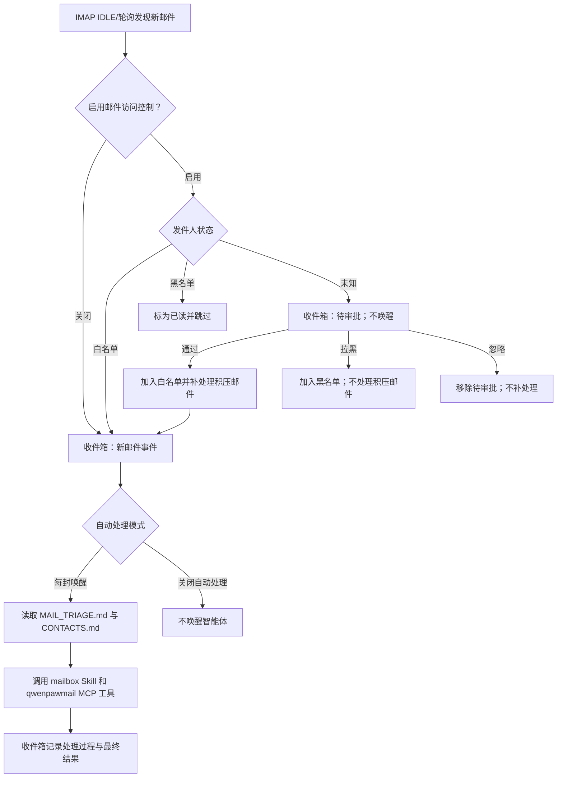

# 邮箱管理与自动化

QwenPaw 可以为每个智能体连接一个独立邮箱，通过 IMAP/SMTP 完成收信、搜索、发信、
回复、转发、附件处理、邮件整理、会话聚合和统计分析。启用新邮件自动响应后，智能体会
自动对邮箱中的新邮件进行智能化处理，还会根据用户习惯随时改进和学习新场景下的邮件
处理能力，逐步实现用户邮箱全托管。

邮箱管理能力由两部分协同完成：

- **qwenpawmail MCP** 提供 22 个工具，负责可靠地读写真实邮箱；
- **Mailbox Skill** 规定账户连接、工具选择、联系人维护、自动分诊和安全边界。

> 邮箱管理仅支持 QwenPaw 原生后端，第三方智能体后端不能配置邮箱。每个智能体的邮箱凭据、
> 监控状态、线程索引、联系人、分诊规则和访问控制名单都相互隔离。

## 使用前准备

1. 确认邮箱服务商已经启用 **IMAP/SMTP**。
2. 准备服务商提供的授权码、应用专用密码或邮箱登录密码。不同服务商的凭据类型不同，不要默认
   使用普通账户密码。
3. 新安装会包含 qwenpawmail MCP。源码开发环境可在仓库根目录运行 `make install-dev`；如果
   QwenPaw 已安装而邮箱子包缺失，可运行 `make install-mail-mcp`。Docker 镜像会随主项目安装
   邮箱子包。
4. 在 **设置 → 技能池** 中确认内置 `mailbox` Skill 已是最新版本，再到目标智能体的
   **工作区 → 技能** 中载入并启用它。旧版本用户应更新技能池，让 `mailbox` 替换已废弃的
   `himalaya` Skill。

保存邮箱配置后，QwenPaw 会自动创建并启用 `qwenpawmail` MCP 驱动卡，同时初始化邮箱工作区
文件，不需要另行启动 MCP server。新生成的驱动卡默认对邮箱工具采用 **审批（ask）** 策略；
可以在 **工作区 → MCP** 中按工具和调用来源调整访问策略。后续修改邮箱配置时，系统会保留
用户已经设置的驱动启用状态、工具范围和访问策略。

## 支持的邮箱服务商

QwenPaw 当前的托管邮箱流程支持以下 9 个个人邮箱域名：

| 邮箱域名      | 服务商        | 所需凭据          | IMAP / SMTP                                   |
| ------------- | ------------- | ----------------- | --------------------------------------------- |
| `163.com`     | 网易 163      | 16 位授权码       | `imap.163.com:993` / `smtp.163.com:465`       |
| `126.com`     | 网易 126      | 16 位授权码       | `imap.126.com:993` / `smtp.126.com:465`       |
| `yeah.net`    | 网易 yeah.net | 16 位授权码       | `imap.yeah.net:993` / `smtp.yeah.net:465`     |
| `qq.com`      | QQ 邮箱       | 16 位授权码       | `imap.qq.com:993` / `smtp.qq.com:465`         |
| `foxmail.com` | QQ 邮箱别名域 | 16 位授权码       | `imap.qq.com:993` / `smtp.qq.com:465`         |
| `sina.com`    | 新浪邮箱      | 16 位授权码       | `imap.sina.com:993` / `smtp.sina.com:465`     |
| `sina.cn`     | 新浪邮箱      | 16 位授权码       | `imap.sina.cn:993` / `smtp.sina.cn:465`       |
| `aliyun.com`  | 阿里邮箱      | 邮箱登录密码      | `imap.aliyun.com:993` / `smtp.aliyun.com:465` |
| `gmail.com`   | Gmail         | 16 位应用专用密码 | `imap.gmail.com:993` / `smtp.gmail.com:465`   |

当前 QwenPaw 托管流程不支持企业邮箱、自定义域名和 Microsoft 邮箱。

> qwenpawmail MCP 子包也可以脱离 QwenPaw 独立使用。独立部署时可用
> `QWENPAWMAIL_IMAP_HOST`、`QWENPAWMAIL_IMAP_PORT`、`QWENPAWMAIL_SMTP_HOST`
> 和 `QWENPAWMAIL_SMTP_PORT` 显式连接其他服务器。

## 连接你的个人邮箱

### 1. 获取正确的客户端凭据

先登录邮箱网页版，在账户、客户端或安全设置中启用 IMAP/SMTP，并生成对应凭据：

- 网易、QQ 和新浪邮箱使用服务商生成的 16 位授权码；
- Gmail 需要先开启两步验证，再创建 16 位应用专用密码；
- 阿里邮箱使用邮箱登录密码。

授权码拥有完整的收发信权限，应像密码一样保管。尽量只在智能体配置界面中填写，不要把它
粘贴到聊天、文档或日志中。修改账户密码、吊销授权码或关闭 IMAP/SMTP 后，已有凭据可能失效。

QwenPaw 不会把凭据明文写入 `agent.json` 或 MCP 驱动卡。公开邮箱配置保存在
`agent.json`，secret 则加密保存在工作区的 `credentials.yaml`，运行 MCP 子进程时才通过
凭据引用解析。API 和智能体读取不到这些 secret，公开配置中没有 `auth_code` 字段也不代表凭据尚未配置。

### 2. 在智能体上配置邮箱

- 打开 **设置 → 智能体管理**，创建或编辑一个 QwenPaw 智能体。
- 在 **邮箱管理** 中选择 **管理你的个人邮箱**。
- 输入邮箱名前缀和域名。例如 `alex` + `163.com` 对应 `alex@163.com`。
- 填入授权码、应用专用密码或邮箱登录密码。
- 选择新邮件自动响应方式：
  - **关闭**：只在聊天中按需管理邮箱，不监控新邮件；
  - **每封唤醒**：监控每封新邮件，并让智能体按照分诊树自主决策。
- 选择 **每封唤醒** 后，可按需开启 **邮件访问控制**。开启后，未知发件人的邮件需先经过审批。
- 保存智能体。

邮箱配置仅对当前智能体生效。第三方后端不支持邮箱配置，复制为第三方后端智能体时也不会复制
邮箱能力。

### 3. 验证收信和发信

在该智能体的聊天中发送：

```text
检查我的邮箱认证是否正常，并列出邮箱文件夹。
```

智能体应先调用 `check_auth`，用全新的连接分别验证 IMAP 和 SMTP，再调用
`list_folders`。建议在开启自动处理前完成验证，因为“能收信”不一定代表“能发信”。

## 为智能体注册专用邮箱

**为智能体配备专属邮箱** 是引导式流程。保存智能体配置只会记录注册意图，不会立即创建
服务商账户，注册仍需在服务商网页完成。

- 在 **设置 → 智能体管理** 中选择 **为智能体配备专属邮箱**。
- 选择邮箱域名，可按需填写期望的邮箱名。留空时，智能体会用 `create_mailbox` 生成符合规则的
  随机名称。
- 此时凭据可以留空。保存后打开该智能体的聊天，请它“为自己注册并连接专用邮箱”。
- 智能体会优先在浏览器中打开服务商注册页面。遇到密码、手机号、图片/短信验证码、滑块和
  协议确认时，由你直接在网页中完成必要的人工步骤。这些注册信息不会保存到 QwenPaw 配置中。
- 注册完成后，在服务商设置中启用 IMAP/SMTP 并生成授权码，再验证收发信连接。
- 重新打开智能体配置，保持选择 **为智能体配备专属邮箱**，填写最终邮箱名和凭据后保存。
  QwenPaw 会自动把 `is_new_account` 设为 `false`、加密保存 secret、同步托管 DriverCard
  并重载智能体。

名称是否可用最终以服务商注册页面的实时结果为准。

## 在聊天中管理邮箱

配置完成后，可以直接使用自然语言下达邮件管理任务。例如：

```text
列出收件箱最新 10 封邮件，只显示发件人、主题和时间。
搜索最近 30 天主题包含“合同”的邮件，并总结待办事项。
把这封邮件的所有附件保存到 attachments/contract-review/。
回复这封邮件，说明我周三下午有空；发送前先给我看草稿。
把这三封邮件标为已读并移动到 Archive。
按会话列出待回复的客户邮件，并统计最近 14 天的平均响应时间。
```

新生成的 qwenpawmail 驱动卡默认采用 `ask` 策略，所以工具调用会进入用户审批。需要自动处理时，
可以为必要的低风险工具或特定调用来源配置 `allow` 策略

> 建议：尽量不要为了省去审批而无条件放开删除、对外发信等高风险操作。

## 支持的邮箱操作

qwenpawmail MCP 共提供 22 个工具。

### 只读工具（11 个）

| 工具                | 说明                                                            |
| ------------------- | --------------------------------------------------------------- |
| `check_auth`        | 分别验证 IMAP 和 SMTP 登录，建议配置后首先调用                  |
| `list_folders`      | 列出全部文件夹，并解码 modified UTF-7 中文名称                  |
| `list_messages`     | 分页列出信封元数据，默认最新在前，不读取正文；每次最多 100 封   |
| `get_message`       | 按文件夹和 UID 获取 text/html 正文及附件元数据，不返回附件内容  |
| `get_attachment`    | 按文件名或从 0 开始的序号获取附件，返回 base64 或保存到工作区   |
| `search_messages`   | 在指定文件夹中按正文关键词、发件人和日期范围组合搜索            |
| `create_mailbox`    | 为网易/腾讯域名校验或生成名称，并返回注册指引，不会自动创建账户 |
| `list_threads`      | 增量同步后按标签、发件人、收件人、主题和日期筛选会话            |
| `search_threads`    | 搜索收件箱和已发送中的内容并映射到线程，排除垃圾箱和垃圾邮件    |
| `get_thread`        | 按时间正序返回线程内的信封元数据；正文仍需用 `get_message` 获取 |
| `get_mailbox_stats` | 统计近期收发量、联系人、趋势、响应时长、待回复和附件等信息      |

### 写操作工具（9 个）

| 工具                | 说明                                                                |
| ------------------- | ------------------------------------------------------------------- |
| `send_message`      | 发送带 `to`/`cc`/`bcc` 的纯文本邮件                                 |
| `reply_message`     | 回复原邮件，自动设置 `In-Reply-To`、`References` 和 `Re:` 主题前缀  |
| `forward_message`   | 转发邮件，原信作为 RFC 822 附件并使用 `Fwd:` 主题前缀               |
| `mark_messages`     | 批量标记已读、未读、星标或取消星标                                  |
| `move_message`      | 移动邮件；目标文件夹不存在时会先尝试创建                            |
| `create_folder`     | 创建文件夹，中文名称自动编码为 modified UTF-7；已存在时也可安全重试 |
| `set_credentials`   | 在当前 MCP 进程内临时覆盖凭据；未知域名还需提供 IMAP/SMTP host      |
| `clear_credentials` | 清除临时凭据；下次调用时回退到启动环境中的托管凭据（如有）          |
| `update_thread`     | 添加或移除自定义线程标签，不能修改系统标签                          |

### 破坏性工具（2 个）

| 工具             | 说明                                                                    |
| ---------------- | ----------------------------------------------------------------------- |
| `delete_message` | 将指定 UID 标记为 `\Deleted`，并在服务商支持时执行 UID 范围内的 EXPUNGE |
| `delete_thread`  | 将线程中的邮件逐封移入自动识别的垃圾箱，并更新本地线程索引              |

邮件 UID 只在对应文件夹中有效。移动邮件后应重新列出目标文件夹，不能继续使用源文件夹的旧
UID。调用 `delete_message` 或 `delete_thread` 前必须确认目标；自动分诊流程禁止调用
`delete_message`。

附件相对路径从智能体工作区解析，绝对路径也必须位于工作区内。`..` 和符号链接不能绕过
工作区边界；以 `/` 结尾的路径会作为目录创建，并使用附件文件名保存。

## 会话线程、标签和统计

线程工具使用本地 JSON 索引，但真实邮件仍以邮箱服务器为准：

- 先根据 `References` 和 `In-Reply-To` 聚合邮件；缺少线程头时，使用去掉 `Re:`、
  `Fwd:`、`回复:`、`转发:` 等前缀后的主题和参与者作为回退依据；
- 首次同步收件箱和自动识别的已发送文件夹，每个文件夹只读取最近 90 天、最多 500 封邮件；
- 后续按 UID 增量同步。服务商更改 `UIDVALIDITY` 时，会清除对应文件夹的旧索引并重新建立
  首次同步窗口，避免旧 UID 指向错误邮件；
- `list_threads` 最多返回 100 个结果，可按全部指定标签、发件人、收件人、主题和日期过滤；
- `inbox`、`sent`、`spam`、`trash` 是从邮件所在文件夹推导的只读系统标签，
  `update_thread` 只管理自定义标签；
- `search_threads` 搜索收件箱和已发送文件夹，按命中数和新近度排序，并明确排除垃圾邮件和
  垃圾箱。服务商不支持全文搜索时，会降级为已同步线程的本地主题匹配；
- `get_mailbox_stats` 支持 1–365 天窗口，每个文件夹最多扫描 1000 封。结果中的
  `truncated: true` 表示扫描上限可能影响统计完整性。

统计结果包括收发总数、未读/星标数量、前 10 位发件人和收件人、每日趋势、回复耗时均值和
中位数、待回复线程、含附件邮件数和体积最大的 5 封邮件。线程索引只是可重建的缓存，不是邮箱
备份；移动、删除或在其他客户端改动邮件后，应重新查询服务器确认结果。

## 自动处理新邮件

选择 **每封唤醒** 后，QwenPaw 监控 `INBOX`。服务商支持时优先使用 IMAP IDLE，服务商
不支持 IDLE，或连续 3 次 IDLE 失败时，自动降级为轮询。轮询默认每 120 秒一次，最短 10 秒。

IDLE 连接会定期重建：一般服务商为 25 分钟。QQ 和 Foxmail 的 IDLE 推送不稳定，因此即使
没有收到服务器的 `EXISTS` 通知，也会至少每 2 分钟主动检查一次新邮件。网络错误会指数退避，
最长 60 秒后重试。

处理流程如下：

1. 如果开启邮件访问控制，先用经过收件服务商认证的发件人身份检查白名单、黑名单和待审批状态。
2. 把新邮件事件和正文预览写入控制台 **收件箱**。
3. 根据自动处理模式决定是否唤醒智能体。
4. 智能体先读取 `MAIL_TRIAGE.md` 和 `CONTACTS.md`，再执行分类、整理、提取或沟通任务。
5. 最终摘要和工具执行轨迹以 `auto_handled` 事件写回收件箱；超时或失败也会留下错误事件。



监控器第一次启动时只记录当前最新 UID 作为基线，不处理已有历史邮件；如果启动时收件箱为空，
之后收到的第一封邮件会正常处理。切换邮箱或检测到 `UIDVALIDITY` 变化时也会重新建立基线，避免
把旧邮箱或旧 UID 空间中的邮件误当作新邮件。

自动流程对每封邮件最多抓取前 64 KiB，并截取约 2000 个字符作为正文预览。附件不会被当作正文
下载；优先使用纯文本，只有 HTML 时才提取可读文字。

### 智能体邮件处理规则和流程

1. 智能体被唤醒后，会先参考 `MAIL_TRIAGE.md` 和 `CONTACTS.md` 再生成邮件管理策略：
   - `MAIL_TRIAGE.md` 是智能体的邮件分流手册，可以在 **工作区 → 文件** 中查看和编辑。默认策略覆盖：
     - A 类：标为已读、归档、星标、隔离垃圾邮件等邮箱状态操作；
     - B 类：台账登记、保存附件、沉淀联系人等信息提取；
     - C 类：提醒、日历、行程和物流跟踪等时间敏感任务；
     - D 类：回复、线程续谈、转发和向已知联系人发送新邮件；
     - E 类：提取验证码等一次性结果；
     - F 类：无法归类、置信度低、动作不可逆或需要点击邮件链接时进入 F1 探索。
   - `CONTACTS.md` 保存已知联系人和关系上下文。自动发信只允许发给已知联系人或原邮件发件人；涉及金钱、承诺或敏感关系时，智能体只应起草内容并请求确认。
2. 按分诊树自上而下匹配新邮件的「识别特征」，命中则按「前置工具链→终态动作」执行；复合场景按组合规则执行。
3. 全部未命中或命中置信度低时走 F 类，进入「F1 探索模式」：
   1. 代入收件人身份分析邮件意图，规划邮件处理流程；
   2. 后续 **每一次工具调用** 都会提升为严格审批，包括邮箱、文件、浏览器和 shell 等工具；
   3. 智能体会在每次调用前说明理由，系统把理由和操作展示给用户：
      - 同意 → 工具正常执行；
      - 拒绝 → 工具被阻止并返回拒绝信息，智能体会换一种思路重新尝试。
   4. 连续 3 次被拒绝或确实无可行方案，则在最终输出中说明情况并请示用户。
4. F1 探索结束后（无论成功与否），回顾整个处理过程：
   1. 总结此类邮件的通用处理做法，并补全「识别特征、前置工具链、终态动作、来源」四个字段；来源格式为「F1 探索 + 日期」；
   2. 修改前备份为 `MAIL_TRIAGE.md.bak`，再把新叶子追加到 `MAIL_TRIAGE.md` 的对应一级类下；一级类只增不改，废弃叶子移入 `deprecated` 区而不直接删除；
   3. 修改后检查格式，让智能体持续学习新场景和用户偏好。
5. 如果回复了邮件，结合本次往来更新 `CONTACTS.md` 中的联系人列表。

配置邮箱后，QwenPaw 会在文件缺失时创建这两个工作区文件；已有内容不会被覆盖。

## 邮件访问控制

访问控制仅在自动处理已开启时可用，用于审批未知发件人的邮件以及对发件人进行加白/加黑。
打开控制台收件箱中的 **邮件管控**，即可管理每个邮箱智能体的待审批发件人、白名单和黑名单。
待处理、白名单和黑名单都支持按智能体筛选以及单条或批量操作；名单条目还可以记录显示名和备注。

### 未知发件人审批

开启访问控制后，收到不在发件人名单中的未知发件人的邮件时，该邮件会进入待审批发件人列表，列表中
可以看到收到邮件的智能体、发件人地址、发件人名称、邮件主题、正文预览、收件时间，用户可以根据需
求对其进行备注，并决定是否 **通过/拉黑/忽略** 该发件人的邮件：

- **通过**：把发件人加入白名单，并逐封补处理该记录中保存的所有邮件；处理失败会保留在重试
  队列中，重启后仍可继续；
- **拉黑**：把发件人加入黑名单并移除待审批记录。已经收到的待审批邮件仍保持原状态；此后的
  来信会被标为已读并跳过；
- **忽略**：只移除当前待审批记录，不加入任何名单。此人的下一封来信会再次进入待审批；之前
  被忽略的邮件不会自动补处理。

> 未知发件人的第一封邮件进入待审批列表，智能体不会读取处理，也不会被唤醒。
> 发件人仍在待处理时，后续来信会静默跳过并保持未读，不会重复创建提醒。
> 每个智能体最多保留 500 条待审批发件人记录，超过时移除最旧记录。

### 发件人名单

发件人名单可以通过审批发件人和手动添加发件人来编辑。

- **白名单**：后续来自该地址的邮件直接放行，并按自动响应模式处理；
- **黑名单**：后续来自该地址的邮件标为已读并跳过；

> 添加发件人时支持精确地址和 `*@example.com` 域名通配符，不支持 `*@*`。
> 添加发件人时需选择具体的智能体；若没有选择，则会把该条目广播到所有已启用邮箱的智能体。

## 配置与本地文件

邮箱配置和状态位于各智能体自己的工作区：

| 路径                                     | 用途                                                                  |
| ---------------------------------------- | --------------------------------------------------------------------- |
| `agent.json`                             | 保存公开邮箱身份、自动响应模式、兼容规则和访问控制开关，不保存 secret |
| `credentials.yaml`                       | 加密保存邮箱授权码/密码；智能体和 Agent API 不会读取或返回明文        |
| `drivers/mcp/qwenpawmail.yaml`           | 自动生成的 qwenpawmail-mcp 驱动卡、凭据引用、运行环境和访问策略       |
| `mail_state/monitor.json`                | 新邮件监控的邮箱指纹、最新 UID、UIDVALIDITY 和失败重试状态            |
| `mail_state/<邮箱命名空间>/threads.json` | 按邮箱地址隔离的本地线程索引                                          |
| `mail_state/<邮箱命名空间>/labels.json`  | 按邮箱地址隔离的自定义线程标签                                        |
| `MAIL_TRIAGE.md`                         | 自动邮件分诊树和安全规则                                              |
| `MAIL_TRIAGE.md.bak`                     | F1 修改分诊树前创建的备份（尚未探索时可能不存在）                     |
| `CONTACTS.md`                            | 已知联系人和关系上下文                                                |
| `mail_access_control.json`               | 该智能体的白名单、黑名单、待审批和审批补处理队列                      |

> 在智能体编辑界面关闭邮箱管理、删除邮箱凭据都会同步更新 qwenpawmail-mcp 驱动卡 等邮箱配置。

## 常见问题

### 邮箱认证为什么会失败？

- 确认完整邮箱地址正确，并已经同时开启 IMAP 和 SMTP；
- 网易、QQ 和新浪使用 16 位授权码，Gmail 使用应用专用密码，阿里邮箱使用邮箱登录密码；
- Gmail 需先在 "Google 个人账户 -> 安全性与登陆" 中开启两步验证；
- QQ 修改账户密码后通常需要重新生成授权码；
- 网易出现 `Unsafe Login` 时，检查客户端授权和服务商安全设置；
- Outlook 系列只支持 OAuth2，当前不能用密码方式接入。

### 智能体无法调用邮箱操作工具

- 确认智能体使用 QwenPaw 原生后端并已保存邮箱配置；
- 确认安装了包含 `qwenpawmail-mcp` 的当前 QwenPaw 版本；
- 在 **工作区 → MCP** 检查 `qwenpawmail` 驱动是否启用且健康；
- 在 **工作区 → 技能** 确认最新 `mailbox` Skill 已载入并启用；旧用户还应在技能池中更新内置
  Skill。

### 邮箱自动响应时，一直提醒我调用邮箱工具需要审批

- 这不是故障，而是新生成的 qwenpawmail 驱动默认策略就是 `ask`。你可以到控制台收件箱的审批页处理请求，或在 **工作区 → MCP** 为明确的低风险工具和调用来源添加精确访问规则；
- 除此之外，如果智能体进入 F1 探索也会把后续所有工具强制提升为严格审批，即使普通会话的审批级别较低也不会绕过，从而避免出现在自主探索中出现不可逆的操作。

### 智能体没有马上收到需要自动处理的新邮件

- 确认新邮件自动响应不是 **关闭**，凭据可用，而且专用邮箱不再处于待注册状态；
- 开启访问控制时，到 **收件箱 → 邮件管控** 检查发件人是否待审批或已在黑名单；
- 检查控制台收件箱是否存在工具审批、自动处理超时或失败事件；
- QQ/Foxmail 的推送不稳定时会主动复查，可能有最长约 2 分钟延迟；其他 IDLE 故障降级为轮询
  后，可能延迟一个轮询周期（2分钟）。

### 搜索、移动或删除结果与预期不同

部分服务商只实现了 IMAP 的子集，QwenPaw 在遇到此类情况时会尝试使用可用条件或本地线程主题降级：

- 网易和新浪不支持正文/发件人服务端搜索，阿里不支持正文全文搜索；尝试使用日期范围、
  `list_messages` 后本地筛选，或改用线程主题搜索；
- 移动后重新列出目标文件夹以获取新 UID；
- 永久删除前先调用 `get_message`，核对文件夹和 UID；
- 线程删除发生部分失败时，重新查询原文件夹和垃圾箱，不要只依赖本地索引。

## 相关页面

- [控制台](./console) — 智能体配置、收件箱、审批和邮件管控入口
- [Skills](./skills) — 更新、载入和启用内置 `mailbox` Skill
- [MCP 与内置工具](./mcp) — qwenpawmail MCP、驱动状态和访问策略
- [配置与工作目录](./config) — `agent.json` 邮箱字段和本地文件
- [安全](./security) — 工具审批、访问策略、文件防护和安全边界
